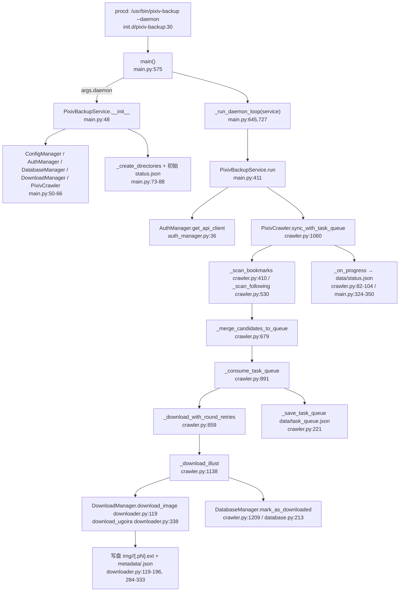
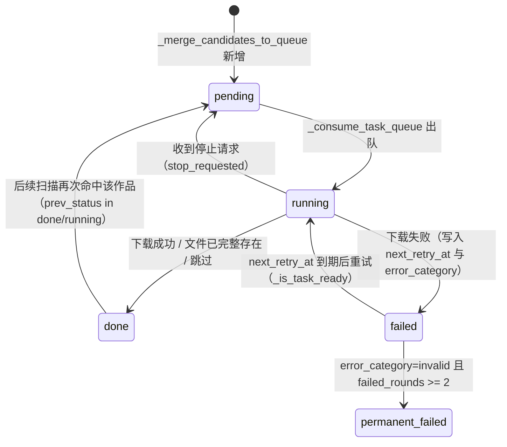

# pixiv-backup 项目结构与实现说明

> 本文档描述仓库 `pixiv-backup` 的**实际实现**：项目作用与行为、文件结构、SQLite 数据库结构、图片 metadata 字段含义及补充细节。
>
> 编写原则：**以 `src/` 下的当前工作区代码为唯一真理来源**。仓库历史文档（`README.md`、`PROJECT_STATUS.md`、`docs/frontend-data-spec.md`）不作为依据；与代码冲突处一律以代码为准，差异集中在 [5.4](#54-与现有文档清单的差异以代码为准) 列出。
>
> 依据快照：2026-10-06 工作区，含以下未提交改动——`AGENTS.md`、`PROJECT_STATUS.md`、`src/luci-app-pixiv-backup/luasrc/model/cbi/pixiv-backup.lua`、`src/pixiv-backup/modules/crawler.py` 为修改状态，`issues.md`、`review.md` 为删除状态。本文所有 `文件:行号` 均指该状态，代码演进后行号可能偏移。
>
> 本文与 `docs/frontend-data-spec.md` 的分工：本文面向**理解实现与数据结构**（模块职责、DDL、构建部署）；后者面向**下游前端读取备份文件**的数据规范。二者冲突时以代码与本文为准。

---

## 1. 项目作用及行为简述

**一句话定位**：`pixiv-backup` 是运行在 OpenWrt 上的常驻守护进程——由 procd 以 `pixiv-backup --daemon` 拉起（`src/init.d/pixiv-backup:29-37`），按固定巡检间隔调用 Pixiv App API，拉取指定用户的收藏(bookmark)与/或关注(following)作者的插画(illust)，以作品为单位下载原图或动图(ugoira)落盘到 `output_dir/img/<illust_id>/`，并写元数据 JSON 与 SQLite 记录；单轮下载由持久化队列(queue) `data/task_queue.json` 驱动。

### 1. 端到端调用链（启动 → 落盘）



逐段调用（真实函数名）：

1. `main()` 组装 argparse（`main.py:575-634`）；`--daemon` 分支构造 `PixivBackupService()` 并进入 `_run_daemon_loop(service)`（`main.py:643-646`）。
2. `PixivBackupService.__init__` 先 `ConfigManager()` 并 `validate_required()`，失败即 `sys.exit(1)`（`main.py:48-57`），再构造 `AuthManager`/`DatabaseManager`/`DownloadManager`/`PixivCrawler`（`main.py:59-66`），建目录（`main.py:73`，`129-147`）并写初始 `status.json`（`main.py:76-88`）。
3. `_run_daemon_loop` 每轮调用 `service.run(max_download_limit=service.config.get_max_downloads())`（`main.py:735`），随后按结果选冷却并 `service.wait_with_force_run(wait_seconds)`（`main.py:740-748, 773`）。
4. `run()` 依次：写 `state=syncing`（`main.py:424-437`）→ `self.auth_manager.get_api_client()`（`main.py:445`）→ 取 `get_download_mode()`/`get_user_id()`/`max_per_sync`（`main.py:451-453`）→ `self.crawler.sync_with_task_queue(user_id, download_mode, max_per_sync, full_scan=...)`（`main.py:454`）→ 写 `phase=done` 并 `_save_run_record`（`main.py:478-501`）。
5. `sync_with_task_queue`：`_load_scan_cursor`（`crawler.py:1076`）→ 按模式 `_scan_bookmarks`（`1079`）/`_scan_following`（`1088`）填充 `candidates` → `_save_scan_cursor`（`1096`）→ `_merge_candidates_to_queue`（`1101`）→ `_consume_task_queue(max_downloads)`（`1109`）→ `_merge_stats`（`1110`）。
6. `_consume_task_queue` 逐项 `_is_task_ready` 判定 → 置 `status=running` 落盘（`948-950`）→ `_download_with_round_retries`（`953`）→ `_download_illust`（`1138`）→ 静态图 `_download_illust_images`（`1237`）/动图 `download_ugoira`（`downloader.py:338`）→ 成功后 `database.mark_as_downloaded`（`1209`）。

### 2. CLI 入口、退出码、日志、信号

退出码常量：`EXIT_OK = 0`、`EXIT_ERROR = 1`、`EXIT_USAGE = 2`（`main.py:40-42`）；另有配置校验失败时 `sys.exit(1)`（`main.py:54-57`）。子命令由 `parser.add_subparsers(dest="command")` 定义（`main.py:591`）：

| 名称 | 类型/来源 | 含义 | 依据 |
|---|---|---|---|
| `--daemon`（`argparse.SUPPRESS`，非子命令） | 全局 flag | 守护模式入口，构造服务后进 `_run_daemon_loop`，返回 `EXIT_OK` | `main.py:589, 643-646` |
| `run <count> [--full-scan]` | 子命令 + 位置参数 int + flag | 单次运行；`count` 作为 `max_download_limit` 覆盖配置；先暂停在跑的守护进程，结束后恢复；`count<=0` 打印错误并返回 `EXIT_USAGE` | `main.py:593-595, 713-720, 1786-1817` |
| `status` | 子命令 | 只读打印配置/数据库/运行状态，返回 `EXIT_OK` | `main.py:597, 648-651, 786-904` |
| `log [-n N] [--no-follow] [--file\|--syslog]` | 子命令 + 4 个参数 | 查看日志，默认 tail 100 行并持续追踪；`--file`/`--syslog` 互斥（同时给出→`EXIT_USAGE`）；`-n<=0`→`EXIT_USAGE` | `main.py:599-603, 1048-1109` |
| `repair [--check] [--apply] [-y]` | 子命令 + 3 flag | 诊断依赖/配置/目录/数据库并修复；`--check` 与 `--apply` 互斥→`EXIT_USAGE`；仅检查且有问题是 `EXIT_USAGE` | `main.py:605-608, 1470-1527` |
| `start [--force-run]` | 子命令 + flag | 透传 `/etc/init.d/pixiv-backup start`；`--force-run` 再 `_trigger_immediate_scan("cli_start_force_run")` | `main.py:610-611, 663-670, 1530-1583` |
| `stop` | 子命令 | 透传 init.d `stop`；成功后延迟 1s 检查残留 PID 并强杀，仍残留则 `EXIT_ERROR` | `main.py:613, 672-675, 1557-1572` |
| `restart [--force-run]` | 子命令 + flag | 透传 init.d `restart`，`--force-run` 同 `start` | `main.py:615-616, 677-684` |
| `test` | 子命令 | 透传 init.d `test` | `main.py:618, 686-689` |
| `trigger` | 子命令 | `_trigger_immediate_scan("cli_trigger")`：写 `force_run.flag` 让守护进程跳过冷却 | `main.py:619, 691-694, 1883-1907` |
| `errors [-n N] [--json]` | 子命令 + 2 参数 | 读数据库 `get_unresolved_errors(limit)` 输出未处理报错，附带 `_classify_error_for_report` 分类 | `main.py:620-622, 1187-1230` |
| `bookmark-order [--restrict R] [--dry-run] [--progress] [--debug]` | 子命令 + 4 参数 | `R` 取值限定 `public\|private\|both`（默认 `both`）；全量重排 bookmark_order | `main.py:623-632, 1232-1331` |
| 无子命令 / 未知 | — | 无子命令时 `parser.print_help()` 后返回 `EXIT_USAGE`（`main.py:722-724`）；未知子命令由 argparse 在 `parser.parse_args()` 阶段以 invalid choice 直接 `SystemExit(2)`（subparsers 未设 `required`，`main.py:591, 634`） | `main.py:591, 634, 722-724` |

日志：

| 名称 | 类型/来源 | 含义 | 依据 |
|---|---|---|---|
| 主日志文件 | `output_dir/data/logs/pixiv-backup-YYYYMMDD.log` | `logging.FileHandler`，启动时创建；同时挂 `StreamHandler(sys.stdout)` | `main.py:91, 94-95, 99` |
| 回退日志文件 | `/tmp/pixiv-backup/pixiv-backup-YYYYMMDD.log` | 主日志目录不可写时回退，并 WARNING；再失败则仅 stdout | `main.py:101-113, 124-127` |
| 日志格式/级别 | `logging.basicConfig(level=INFO, force=True)`，格式 `%(asctime)s - %(name)s - %(levelname)s - %(message)s` | 全局根日志配置 | `main.py:117-122` |
| CLI 审计日志 | 追加写 `pixiv-backup-YYYYMMDD.log`（`- pixiv-backup.cli - INFO -` 前缀）+ `logger -t pixiv-backup.cli` | 每条 CLI 命令与结果都落盘/落 syslog | `main.py:1714-1730` |
| 轮转方式 | 无轮转实现 | 文件名按天变化，`logging.FileHandler` 不切割也不删除；`_follow_file_logs` 仅在追踪时检测新日期文件并切换句柄 | `main.py:928-1003` |
| `LOG_PATTERN` | `"pixiv-backup-*.log"` | `_latest_log_file` 取 mtime 最新者 | `main.py:43, 906-917` |

信号处理：`_install_signal_handlers(service)` 注册 `SIGTERM`/`SIGINT` → `service.request_stop(f"signal_{signum}")`（`main.py:1663-1671`），**仅在 `--daemon` 模式安装**（`main.py:729`）。`request_stop` 幂等置位 `STOP_EVENT`（模块级 `threading.Event()`，`main.py:45`）并写 `state=stopping/phase=stop_requested`（`main.py:352-368`）；`is_stop_requested()` 返回 `self.stop_requested or STOP_EVENT.is_set()`（`main.py:369-370`）。停止请求在爬取/下载循环中通过 `_should_stop()` 轮询（`crawler.py:55-59`、`downloader.py:41-45`），并在分块写盘中途检查（`downloader.py:156-157, 384-385`）。CLI 前台模式下 `run()` 捕获 `KeyboardInterrupt` → `request_stop("keyboard_interrupt")`（`main.py:512-522`）；`log` 追踪同样捕获（`main.py:997-999, 1038-1045`）。

### 3. 配置项：UCI option → 内部读取 → 默认值 → 消费者

加载机制：`_load_config` 执行 `uci -q show pixiv-backup` 并按 `key.split('.')` 取 `section.option`（`config_manager.py:15-52`）；随包配置声明 `config main 'settings'`（`src/config/pixiv-backup:1`），故 `uci show` 得到 `pixiv-backup.settings.*`，`_detect_main_section` 返回 `settings`（`config_manager.py:54-61`）。

| 名称 | 类型/来源 | 含义 | 依据 |
|---|---|---|---|
| `enabled` | UCI option；**Python 侧无 getter**，默认 `'0'` | 是否启用服务：hotplug 判断后才 `pixiv-backup start`；init.d `status` 显示；LuCI commit 时 `enable/disable` init.d | `src/config/pixiv-backup:2`；`src/hotplug/99-pixiv-backup:10-12`；`src/init.d/pixiv-backup:187`；`src/luci-app-pixiv-backup/luasrc/model/cbi/pixiv-backup.lua:57-64` |
| `user_id` | `ConfigManager.get_user_id()`（必填）；无代码默认值 | Pixiv 用户 ID；`main.run` 透传给 `sync_with_task_queue`，crawler 内 `int(user_id)` 调 API；CLI `bookmark-order` 也取用 | `src/config/pixiv-backup:3`；`config_manager.py:73-89, 93-95`；`main.py:452-454`；`crawler.py:443, 449, 551, 557`；`bookmark_order_rebuilder.py:306` |
| `refresh_token` | `get_refresh_token()`（必填）；无代码默认值 | 换取 access_token；成功后回写 `data/token.json` | `src/config/pixiv-backup:4`；`config_manager.py:97-99`；`auth_manager.py:46-52, 72-89` |
| `output_dir` | `get_output_dir()`，默认 `'/mnt/sda1/pixiv-backup'` | 输出根目录，派生 `img`/`metadata`/`data`(→`pixiv.db`、`cache`、`logs`) | `src/config/pixiv-backup:5`；`config_manager.py:101-106, 178-200` |
| `mode` | `get_download_mode()`，默认 `'bookmarks'` | 下载模式；决定扫描 bookmarks/following/both | `src/config/pixiv-backup:6`；`config_manager.py:108-110`；`crawler.py:1078, 1087` |
| `restrict` | `get_restrict_mode()`，默认 `'public'` | 收藏/关注可见性，**原样**作为 API `restrict` 参数 | `src/config/pixiv-backup:7`；`config_manager.py:112-114`；`crawler.py:419, 442-451, 538, 550-559` |
| `max_downloads` | `get_max_downloads()`，默认 `1000`（`int` 失败也回落 1000） | 单轮最多成功下载作品数；daemon 每轮传入，`run <count>` 时被 `count` 覆盖；`0` 表示不限 | `src/config/pixiv-backup:8`；`config_manager.py:116-121`；`main.py:453, 735`；`crawler.py:916-918` |
| `timeout` | `get_timeout()`，默认 `30` | 网络超时秒；用于 `AppPixivAPI(timeout=)` 与 `session.get(timeout=)` | `src/config/pixiv-backup:9`；`config_manager.py:123-127`；`auth_manager.py:42-43`；`downloader.py:23, 145` |
| `sync_interval_minutes` | `get_sync_interval_minutes()`，默认 `360`，`<=0` 回落 360 | 正常轮次（`normal_interval`）冷却分钟 | `src/config/pixiv-backup:10`；`config_manager.py:130-136`；`main.py:730, 747` |
| `cooldown_after_limit_minutes` | `get_cooldown_after_limit_minutes()`，默认 `60`，`<=0` 回落 60 | `hit_max_downloads` 时冷却分钟 | `src/config/pixiv-backup:11`；`config_manager.py:138-144`；`main.py:731, 743-745` |
| `cooldown_after_error_minutes` | `get_cooldown_after_error_minutes()`，默认 `180`，`<=0` 回落 180 | `rate_limit_or_server_error` 时冷却分钟 | `src/config/pixiv-backup:12`；`config_manager.py:146-152`；`main.py:732, 740-742` |
| `interval_jitter_ms` | `get_interval_jitter_ms()`，默认 `1000`，`<0` 回落 1000 | 低速阶段每次等待额外叠加 `randint(0, 该值)/1000` 秒，只增不减 | `src/config/pixiv-backup:13`；`config_manager.py:170-176`；`crawler.py:28, 136-137` |
| `high_speed_queue_size` | `get_high_speed_queue_size()`，默认 `20`，`<0` 回落 20 | 本轮已处理数 `<=` 该值时**不等待**（高速阶段） | `src/config/pixiv-backup:14`；`config_manager.py:154-160`；`crawler.py:26, 132` |
| `low_speed_interval_seconds` | `get_low_speed_interval_seconds()`，默认 `1.5`，`<0` 回落 1.5 | 低速阶段基础等待秒数 | `src/config/pixiv-backup:15`；`config_manager.py:162-168`；`crawler.py:27, 134` |

legacy 段兼容：`_detect_main_section` 优先 `settings`、否则 `main`、都无则 `settings`（`config_manager.py:54-61`）；`get(section, option)` 对 `main`/`settings` 互做回退（`config_manager.py:62-71`）；`validate_required` 校验的是 `self.main_section` 下的 `user_id`/`refresh_token`/`output_dir`，缺失打印 `缺少必要配置: ...` 并返回 False（`config_manager.py:73-89`）。此外 `main.py` 的 `_resolve_force_run_output_dirs` **绕过 ConfigManager** 直接 `uci -q get`，依次尝试 `pixiv-backup.settings.output_dir`、`pixiv-backup.main.output_dir`、`/mnt/sda1/pixiv-backup`（`main.py:1674-1712`）；hotplug 亦先读 `settings.enabled` 再回退 `main.enabled`（`src/hotplug/99-pixiv-backup:10-11`）。

### 4. 模式、restrict、user_id

| 名称 | 类型/来源 | 含义 | 依据 |
|---|---|---|---|
| `mode='bookmarks'` | UCI 字符串 | 只跑 `_scan_bookmarks`；LuCI 下拉可选 | `crawler.py:1078-1079`；`src/luci-app-pixiv-backup/luasrc/model/cbi/pixiv-backup.lua:88-92` |
| `mode='following'` | UCI 字符串 | 只跑 `_scan_following`（**不会**再跑 bookmarks） | `crawler.py:1087-1088` |
| `mode='both'` | UCI 字符串 | 先 bookmarks，再（未被限速/停止时）following | `crawler.py:1078, 1087` |
| 其它 `mode` 取值 | — | 两个 `if` 均不命中：`candidates` 为空，仍执行 `_merge_candidates_to_queue` 与 `_consume_task_queue`，即继续消化队列中既有任务 | `crawler.py:1101-1115` |
| `restrict` 取值 | UCI 字符串 | crawler 内**不做取值校验**，直接透传给 `user_bookmarks_illust` / `user_following`；`both` 仅由 CLI `bookmark-order` 与 `BookmarkOrderRebuilder._fetch_all_bookmark_ids` 消费（合并 public+private 去重），crawler 无 `both` 分支 | `crawler.py:419, 442-451, 538, 550-559`；`main.py:624-629`；`bookmark_order_rebuilder.py:100-129` |
| `user_id` 用法 | UCI 字符串 → `int()` | 仅作为 API 调用的 `user_id`：收藏 `api.user_bookmarks_illust(user_id=int(user_id), restrict=...)`、关注列表 `api.user_following(...)`、作者作品 `api.user_illusts(user_id=int(follow_user_id))` | `crawler.py:443-451, 551-559, 608-613`；`main.py:452` |

### 5. 调度与限流

| 名称 | 类型/来源 | 含义 | 依据 |
|---|---|---|---|
| `sync_interval_minutes` | 配置 getter（默认 360） | 非限速、非触顶时的轮间冷却：`base_wait_seconds = sync_interval_minutes * 60`，`reason="normal_interval"` | `main.py:730, 747-748` |
| `cooldown_after_limit_minutes` | 配置 getter（默认 60） | `result["hit_max_downloads"]` 时 `base_wait_seconds = cooldown_limit_minutes * 60`，`reason="hit_max_downloads"` | `main.py:731, 743-745` |
| `cooldown_after_error_minutes` | 配置 getter（默认 180） | `result["rate_limited"]` 时 `base_wait_seconds = cooldown_error_minutes * 60`，`reason="rate_limit_or_server_error"`（优先级最高） | `main.py:732, 740-742` |
| 冷却等待实现 | `service.wait_with_force_run(wait_seconds)` | 1 秒步进 sleep 的循环，每步先查停止请求、再查 `force_run.flag`；命中 flag 则删除并写 `phase=force_triggered` 提前返回 True | `main.py:773, 382-400`（`time.sleep(step)` 在 398） |
| 冷却状态落盘 | `status.json` | 写 `state=cooldown/phase=waiting/cooldown_reason/next_run_at/cooldown_seconds/base_cooldown_seconds` | `main.py:751-760` |
| `high_speed_queue_size` | 配置 getter（默认 20） | `_queue_sleep` 中若 `high_speed_queue_size > 0 and processed_total <= high_speed_queue_size` 则直接 return（不 sleep） | `crawler.py:26, 132-133` |
| `low_speed_interval_seconds` | 配置 getter（默认 1.5） | 低速阶段 `base_seconds` | `crawler.py:27, 134` |
| `interval_jitter_ms` | 配置 getter（默认 1000） | `jitter_seconds = random.randint(0, interval_jitter_ms)/1000.0`，`sleep_seconds = base + jitter`，实际 `time.sleep(sleep_seconds)`（并记 `queue_sleep` 事件） | `crawler.py:28, 136-146` |
| 任务间隔触发点 | `_queue_sleep(stats["total"])` | 在每个任务处理完、且本轮未被限速/触顶/停止时调用；`skipped` 的任务**不**等待 | `crawler.py:1031-1039` |
| 队列工作方式 | `data/task_queue.json`（`version=1`，`items[]`） | 条目状态机 `pending|running|failed|permanent_failed|done`；消费按文件顺序 `for item in items`；`_is_task_ready` 对 `failed` 比对 `next_retry_at`；每步变更即 `_save_task_queue` 全量重写 | `crawler.py:29, 171-229, 750-758, 891-911, 948-950` |
| 队列崩溃恢复 | `_recover_running_tasks` | 消费开始前把遗留 `status=running` 的条目重置为 `pending`，`last_error="recovered_from_previous_running_state"` | `crawler.py:183-194, 903-905` |
| `max_downloads` 作用点 | 配置 getter / `run <count>` | `downloaded_count` 只累计成功项；`if max_downloads > 0 and downloaded_count >= max_downloads` → `hit_max_downloads=True` 并 break；`0` 视为不限 | `crawler.py:907, 916-918, 963-964` |
| `timeout` 作用点 | 配置 getter | `AppPixivAPI(timeout=...)`（API 请求）与 `requests.Session.get(url, timeout=self.timeout, stream=True)`（图片/zip 流式下载）；`DownloadManager.timeout` 在构造时定格 | `auth_manager.py:42-43`；`downloader.py:23, 145`；`downloader.py:55`（ugoira 走 `api_client.requests_kwargs`） |

补充：轮间冷却时 `run()` 内部不 sleep；`force_run.flag` 也可由 CLI `trigger`/`start --force-run`/`restart --force-run` 写入（`main.py:665-668, 679-682, 1883-1907`），LuCI 亦调用 `trigger` 或 `start --force-run`（`src/luci-app-pixiv-backup/luasrc/controller/pixiv-backup.lua:355-358`）。

### 6. 爬取逻辑

- **分页实现**：全部走 `next_url` 透传。`_next_url_kwargs(next_url, excluded_keys)` 解析 query 并剔除已显式传参（`crawler.py:67-80`）：收藏页剔除 `user_id`/`restrict`（`crawler.py:445-446`），关注用户列表同（`553-554`），作者作品页仅剔除 `user_id`（`610`）。
- **翻页终止条件**：`next_url` 为空即 break（收藏 `crawler.py:511-513`；关注列表 `572-574`；作者作品 `660-663`）；`_should_stop()` 命中即停（多处，如 `430-434, 465-470`）；收藏增量命中阈值即整轮停（见下）。
- **收藏增量与去重停止**：非 `full_scan` 时先收集队列中 `done`/`permanent_failed` 的 `illust_id` 成 `done_like_ids`（`crawler.py:422-427`），逐作品 `is_existing = (illust_id in done_like_ids) or self.downloader.is_illust_fully_downloaded(illust)`；命中则 `existing_streak += 1`，连续达到 `BOOKMARK_EXISTING_STREAK_STOP = 10` 即 `incremental_stopped=True` 并停止整轮扫描（`crawler.py:14, 481-503`）。
- **去重/已下载跳过**：候选以 `dict[illust_id]` 聚合，`_upsert_candidate` 合并 `is_bookmarked`/`is_following_author`/`bookmark_order`（`crawler.py:395-408`）；入队前 `is_illust_fully_downloaded` 命中则计入 `skipped_downloaded` 并把既有队列项置 `done`（`688-699`）；消费前再次校验并置 `done`（`932-944`）；文件级 `save_path.exists()` 直接返回 `skipped`（`downloader.py:138-140`）。
- **following 与 bookmarks 差异**：bookmarks 单层分页 + `existing_streak` 停止（`crawler.py:410-528`）；following 先分页拉 `user_following` 的 `user_previews[].user.id`（`550-570`），再对每个作者分页 `user_illusts`（`608-613`），增量游标为 `scan_cursor.following.authors[author_id].latest_seen_illust_id`，逐作品命中该 id 即停该作者（`592-593, 642-647`）；若首页 `create_date` 非降序或存在重复 id（`_is_following_order_unreliable`），则放弃增量改全量（`379-393, 628-631`）。标记差异：收藏候选 `is_bookmarked=True, is_following_author=False`（`506`），关注候选反之（`656`）。
- **失败重试与状态回滚（扫描阶段）**：单页异常只记录 `stats["last_error"]` 并按限速关键字置 `rate_limited`，随后 break，无重试（收藏 `crawler.py:452-462`；following users `563-571`；作者作品 `614-623`）；本轮 `last_error` 取 `scan_errors[-1]`（`1098-1099`）。
- **bookmark_order 分配**：`_assign_bookmark_order` 把「最新在前」的 id 反转成 oldest→newest 递增序号；`full_scan` 从 0 起，否则从 `_get_existing_bookmark_order_max(scan_cursor) + 1` 起（`crawler.py:326-367`；最大值来源为 `scan_cursor.bookmarks.max_bookmark_order` → 队列项 → `metadata/*.json`，`303-324, 285-301`）。

### 7. 下载逻辑

- **并发模型**：**单线程串行**。`DownloadManager` 仅持一个 `requests.Session`（`downloader.py:14`），`_consume_task_queue` 用 `for item in items` 顺序处理（`crawler.py:911`）；源码中无 `threading`/`multiprocessing`/`asyncio` 于下载路径（`threading` 仅用于 `STOP_EVENT`，`main.py:45`）。多图作品在 `_download_illust_images` 内逐页串行下载（`crawler.py:1240-1270`）。
- **停止响应**：`_should_stop()` 在每页任务前与分块写盘中途检查（`crawler.py:55-59`；`downloader.py:156-157, 384-385`）。
- **重试与退避**：轮内最多 `MAX_ATTEMPTS_PER_ROUND = 3` 次 `_download_illust` 调用，失败即分类；分类为 `rate_limit` 立即跳出剩余尝试（`crawler.py:12, 859-884`）。跨轮：`retry_count += 1` 后 `_next_retry_seconds(retry_count) = min(3600, 60 * 2 ** min(6, retry-1))` 写入 `next_retry_at`（`886-889, 986-995`）。
- **错误分类**：`_classify_error` —— 404/410→`invalid`，429 与 500/502/503/504 与（非 invalid 关键字的）403→`rate_limit`，401→`auth`，关键字命中 `network`/`auth` 等（`crawler.py:799-857`）；`invalid` 时 `failed_rounds += 1`，达到 `INVALID_FAILED_ROUNDS_LIMIT = 2` 置 `permanent_failed`（不再重试）（`crawler.py:13, 997-1003`）。
- **限速**：任一任务分类为 `rate_limit` 即 `stats["rate_limited"]=True` 并中断本轮消费循环（`crawler.py:1025-1034`），进而由 daemon 选 `cooldown_after_error_minutes`（`main.py:740-742`）；节奏控制见 §5 `_queue_sleep`。
- **文件完整性**：临时文件 `.part` → `f.flush()` → `os.fsync(fileno())` → `os.replace(tmp, final)` 原子落盘，异常时删除临时文件（图片 `downloader.py:150-166`；ugoira zip `378-394`）。下载结束后 `_download_illust` 再次调用 `is_illust_fully_downloaded`，不完整则判失败（`crawler.py:1201-1206`）；该方法对多图按 `page_count` 逐页定位 `img/<id>/<id>.pN.ext`，URL 缺失时用 `glob(f"{id}.p{idx}.*")` 兜底；ugoira 只校验 `<id>.zip`；访问受限作返回 False（`downloader.py:225-260`）。
- **失败后写回 DB 状态**：`_record_download_failure(illust_id, error_msg)` 先 `database.mark_as_not_downloaded(illust_id)`（置 `downloaded=0, download_path=NULL, downloaded_at=NULL`）再 `record_download_error`（向 `download_history` 插 `success=0` 记录）（`crawler.py:1128-1136`；`database.py:251-276, 278-297`）。成功路径 `mark_as_downloaded(illust_id, file_path, file_size)` 置 `downloaded=1` 并插 `download_history(success=1)`（`crawler.py:1209`；`database.py:213-246`）；`skipped` 也标记 `mark_as_downloaded(illust_id, "已存在", 0)`（`crawler.py:1212-1215`）。
- **访问受限(limit_unknown)特殊路径**：`is_access_limited_illust` 命中时先写元数据快照 `is_access_limited=True` 并跳过下载，返回 `http_status=403`（`crawler.py:1150-1158`；`downloader.py:78-117`）；页级亦检查 `is_access_limited_url`（`crawler.py:1251-1252, 1282-1283`；`downloader.py:66-76`）。
- **动图**：`api.ugoira_metadata(str(illust_id))` → `_extract_ugoira_metadata`（兼容 `ugoira_metadata`/`metadata`/`body`/`data`/`result` 多层，需含 `zip_url`/`zip_urls` 或非空 `frames`）（`crawler.py:1164-1165, 1295-1335`）；若 API 明确不是 ugoira 则降级为静态图下载并继承队列标记（`crawler.py:1170-1185`）；下载 `zip_url`/`zip_urls.original|medium|large|small` 到 `img/<id>/<id>.zip`，并把 `ugoira_frames`/`ugoira_zip_url` 写进元数据（`downloader.py:338-433, 435-440`；`326-330`）。
- **元数据 JSON**：`metadata/<illust_id>.json`，字段含 `illust_id/title/caption/user{...}/create_date/page_count/width/height/bookmark_count/view_count/sanity_level/x_restrict/type/tags/image_urls/tools/download_time/original_url/is_bookmarked/is_following_author/bookmark_order/is_access_limited`（`downloader.py:284-333`）。

### 8. 鉴权

- **token 来源**：UCI `refresh_token`（`config_manager.py:97-99`）；`pixivpy3` 优先从包内 `vendor/` 导入，失败则模块级 `PIXIVPY_AVAILABLE=False`，`AuthManager.__init__` 直接抛 `ImportError("pixivpy3库不可用，...")`（`auth_manager.py:10-19, 32-35`）；`CLIENT_ID`/`CLIENT_SECRET` 硬编码（`auth_manager.py:29-30`）。
- **刷新流程**：`get_api_client()` 进程内缓存单例（`auth_manager.py:38-39`）→ `AppPixivAPI(timeout=config.get_timeout())`（`42-43`）→ `refresh_token` 为空则 `raise ValueError("未配置refresh_token")`（`46-48`）→ `api_client.auth(refresh_token=refresh_token)`（`52`）→ 成功即 `_save_token_info()` 写 `data/token.json` = `{access_token, refresh_token, expires_at: now+3600, saved_at}`（`55, 72-89`）。
- **过期处理**：主 `auth(refresh_token=)` 抛异常时，`_load_saved_token()` 读 `token.json` 且**仅当** `time.time() < expires_at` 返回 True，再用 `auth(access_token=self.token_data["access_token"])` 重试一次，仍失败才向外抛（`auth_manager.py:57-70, 91-110`）。注意 `expires_at` 是「假设1小时后过期」的常量推算（`auth_manager.py:81`），而带 5 分钟提前量的 `refresh_token_if_needed()`（阈值 `expires_at - 300`）在 `src/` 内**没有任何调用点**（`auth_manager.py:112-130`）。
- **失败表现**：最终 `raise Exception(f"无法连接到Pixiv API: {e}")`（`auth_manager.py:70`）→ `main.run()` 的 `except Exception` 记录 `phase=error`/`last_error`/`recent_errors` 并返回 `success=False`（`main.py:523-534`）→ 该轮按「未限速、未触顶」走 `normal_interval` 冷却后继续下一轮（`main.py:735-748`）；`__init__` 阶段配置缺失则在服务构造时 `sys.exit(1)`，procd 由 `respawn` 兜底（`main.py:54-57`；`src/init.d/pixiv-backup:31`）。CLI 侧 `pixiv-backup test` 走 `AuthManager.test_connection()`（`auth_manager.py:132-152`；`src/init.d/pixiv-backup:118-131`）。

### 9. bookmark_order_rebuilder 的作用与触发时机

- **作用**：`BookmarkOrderRebuilder.rebuild()` 全量分页拉取收藏 id（最新在前，去重），`_build_order_map` 反转为「最旧=0，越新越大」的序号，再据此同时改写三处持久化状态（`bookmark_order_rebuilder.py:305-354`）：

| 名称 | 类型/来源 | 含义 | 依据 |
|---|---|---|---|
| `metadata/*.json` | 文件，`metadata_dir.glob("*.json")` | 命中则写 `bookmark_order=target` 与 `is_bookmarked=True`；未命中保留原值仅计 `unmatched`；解析失败计 `parse_failed` | `bookmark_order_rebuilder.py:138-200` |
| `data/task_queue.json` | 文件，`items[]` | 命中则写条目 `bookmark_order`/`is_bookmarked`，并同步写 `item["illust"]` 的同名字段 | `bookmark_order_rebuilder.py:202-269` |
| `data/scan_cursor.json` | 文件 | 写 `bookmarks.max_bookmark_order = max(order_map.values())`（空则为 -1）与 `bookmarks.updated_at` | `bookmark_order_rebuilder.py:299-303, 327` |

- **写入方式**：`_write_json_atomic` 用 `<path>.tmp` + `tmp_path.replace(path)` 原子替换（`bookmark_order_rebuilder.py:41-47`）；`dry_run=True` 只统计不写（`bookmark_order_rebuilder.py:341-347`）。
- **restrict 语义**：`public`/`private` 单拉；`both` 分别拉后按出现顺序合并去重（public 在前）；其它值 `raise ValueError`（`bookmark_order_rebuilder.py:100-129`）。
- **触发时机**：**只有** CLI 子命令 `pixiv-backup bookmark-order` 一条路径（`main.py:623-632, 701-711` → `handle_bookmark_order_command`，`main.py:1232-1331`）。该命令若检测到守护进程在运行，会先执行 `/etc/init.d/pixiv-backup stop`，且**不会自动重启**（`main.py:1237-1255`）；常规 `--daemon` 巡检与 `run` 均不调用它。常规同步的序号递增由 `crawler._assign_bookmark_order` 负责（见 §6），二者分工不同。

### 10. 长跑进程的自身状态

- **单实例/互斥**：Python 层**没有**单实例锁（无 `flock`/lock 文件；全仓仅 `src/init.d/pixiv-backup:35` 的 `procd_set_param pidfile /var/run/pixiv-backup.pid`），互斥依赖 procd 单实例 + `respawn`（`src/init.d/pixiv-backup:29-37`）。CLI 侧用「先停守护再干活」规避并发：`run` 会先 `stop` 并在 `finally` 中恢复（`main.py:1786-1817`），`bookmark-order` 会先 `stop` 且不恢复（`main.py:1237-1255`）；`_is_service_running()` 通过 `/etc/init.d/pixiv-backup running` 判定（`main.py:1778-1784`）。
- **状态文件**：

| 名称 | 类型/来源 | 含义 | 依据 |
|---|---|---|---|
| `output_dir/data/status.json` | JSON | 运行快照：`state`/`phase`/`message`/`processed_total`/`last_run_processed_total`/`total_processed_all`/`success`/`skipped`/`failed`/`queue_pending`/`queue_running`/`queue_failed`/`queue_done`/`queue_permanent_failed`/`recent_errors`/`cooldown_reason`/`next_run_at`/`cooldown_seconds`/`hit_max_downloads`/`rate_limited`/`last_error`/`last_run`/`updated_at`；由 `_write_runtime_status` 读改写合并 | `main.py:149-175, 411-500, 751-760` |
| `output_dir/data/force_run.flag` | 空文件 | 「跳过当前冷却立即开跑」信号；`_consume_force_run_flag` 读到即 `unlink` 并返回 True | `main.py:152-153, 372-380, 389-396`；写入 `main.py:1746-1776` |
| `output_dir/data/run_history.json` | JSON 数组 | 每轮记录 `timestamp/stats/elapsed_time/config{user_id,download_mode,restrict,max_downloads}`，**只保留最近 100 条** | `main.py:536-569` |
| `output_dir/data/last_run.txt` | 文本 | 最近一次运行完成时间 | `main.py:570-573` |
| `output_dir/data/task_queue.json` | JSON（`version/updated_at/items`） | 持久化任务队列，每次状态变更全量重写 | `crawler.py:29, 221-229` |
| `output_dir/data/scan_cursor.json` | JSON（`bookmarks`/`following.authors`） | 增量扫描游标与 `max_bookmark_order` | `crawler.py:30, 231-268` |
| `output_dir/data/token.json` | JSON | `access_token`/`refresh_token`/`expires_at`/`saved_at` | `auth_manager.py:76, 80-83` |
| `output_dir/data/pixiv.db` | SQLite（表 `illusts`、`download_history`、用户表） | 作品下载状态与历史 | `config_manager.py:190-192`；`database.py:213-333` |
| `recent_errors` 上限 | status.json 字段 | 最多 10 条，且写入前 `_prune_recent_errors` 会剔除数据库中已下载(`is_downloaded`)的 pid，并按 `(pid, action, error)` 去重 | `main.py:278-296, 298-322` |

- **日志清理**：**不存在**。日志由 `logging.FileHandler` 持有按天命名的文件，无 size/time 轮转、无保留天数、无删除逻辑（`main.py:89-122`；CLI 审计亦只追加 `main.py:1714-1730`）；仓库内无 logrotate 相关安装项（`Makefile` 安装清单仅 config/init.d/hotplug/docs 与 LuCI 文件），init.d 只是展示最新日志文件（`src/init.d/pixiv-backup:167-183`）。唯一带「清理」语义的 `DatabaseManager.cleanup_old_records(days=30)` 在 `src/` 中**无调用点**（`database.py:416-435`）。`data/cache` 与 `data/thumbnails` 目录仅被创建，无任何读写引用（`main.py:129-147` 创建；`config_manager.py:194-196` 仅返回路径）。
- **停机收尾**：`SIGTERM`/`SIGINT` → `request_stop` 写 `state=stopping`（`main.py:1663-1671, 352-368`）→ 爬取/下载循环轮询退出 → daemon 循环末尾写 `state=idle/phase=stopped/stopped_at` 并记 `daemon_stopped` 事件（`main.py:776-783`）；CLI `stop` 在 init.d 停止成功后还会 sleep 1s 复查 `_list_daemon_pids()`，有残留则 `SIGTERM`→`SIGKILL`→`pkill -9 -f`/`killall -9` 兜底，仍残留则返回 `EXIT_ERROR`，并额外把 `status.json` 覆盖为停止态（`main.py:1557-1572, 1613-1661, 1835-1852`）。

---

## 2. 文件结构、构建与部署

### 1. 目录树与文件作用

```text
pixiv-backup/
├── Makefile                      # OpenWrt 包定义（两个子包 + 5 个 wheel 下载 + 安装规则）
├── README.md                     # 使用说明（功能、配置、命令行、输出目录结构）
├── AGENTS.md                     # 面向协作代理的项目说明与目录概览
├── PROJECT_STATUS.md             # 项目状态记录（已被 .gitignore 忽略）
├── LICENSE                       # GPL-3.0 全文
├── .github/workflows/
│   ├── build-openwrt.yml         # OpenWrt SDK 构建工作流
│   └── README.md                 # 工作流说明
├── .gitignore                    # 忽略 __pycache__/.venv/编辑器文件/项目状态文件
├── test.txt                      # 仅含占位文本 "test content"
├── docs/
│   ├── frontend-data-spec.md     # 前端读取本地备份文件的数据规范
│   ├── refresh-token.md          # Pixiv refresh token 获取指南（随包安装到设备）
│   └── struct.md                 # 本文档（项目结构与实现说明）
├── tests/
│   ├── test_crawler_following.py # crawler 关注流相关单元测试
│   └── test_ugoira_download.py   # downloader 动图(ugoira)下载单元测试
├── tools/
│   └── backfill_bookmark_order.py# 独立脚本：拉取收藏并回填 bookmark_order
└── src/
    ├── config/pixiv-backup       # 出厂 UCI 默认配置
    ├── init.d/pixiv-backup       # procd 服务脚本
    ├── hotplug/99-pixiv-backup   # WAN ifup 热插拔钩子
    ├── luci-app-pixiv-backup/luasrc/
    │   ├── controller/pixiv-backup.lua   # LuCI 路由与 JSON/文本接口
    │   ├── model/cbi/pixiv-backup.lua    # LuCI CBI 配置界面
    │   └── view/                          # 空目录（无 view 文件）
    └── pixiv-backup/
        ├── main.py               # 主程序（CLI + 守护进程入口）
        ├── requirements.txt      # Python 依赖声明
        ├── modules/
        │   ├── __init__.py
        │   ├── config_manager.py          # UCI 配置读取与校验
        │   ├── auth_manager.py            # OAuth 鉴权与连接测试
        │   ├── crawler.py                 # 收藏/关注作品抓取
        │   ├── database.py                # SQLite 状态库
        │   ├── downloader.py              # 图片与元数据下载
        │   └── bookmark_order_rebuilder.py# 收藏序号重排
        └── tools/
            └── __init__.py   # 含注释 "# Pixiv Backup Tools"
```

各文件作用依据：`Makefile:69-79`（构建时复制 `src/`、`docs/`）、`Makefile:89-125`（安装规则引用各路径）；其余条目以工作区实际文件内容为准。

| 路径 | 类型/来源 | 含义 | 依据 |
|---|---|---|---|
| `Makefile` | OpenWrt 包 Makefile | 定义 `pixiv-backup`、`luci-app-pixiv-backup` 两个包 | `Makefile:13,26,137-138` |
| `README.md` | 文档 | 项目使用说明；`## 目录结构` 在 `README.md:60-82`，`## 元数据结构` 起于 `README.md:84` | `README.md:1-13, 60-122` |
| `AGENTS.md` | 文档 | 协作代理指南与目录概览 | `AGENTS.md:1-18` |
| `PROJECT_STATUS.md` | 文档 | 项目状态记录，且被 `.gitignore` 忽略 | `.gitignore:14` |
| `LICENSE` | 文本 | GPL-3.0 全文 | `LICENSE:1-2`；`Makefile:8` |
| `.gitignore` | 配置 | 忽略 `__pycache__/`、`*.py[cod]`、`.venv/`、`PROJECT_STATUS.md` 等 | `.gitignore:4-14` |
| `test.txt` | 文本 | 仅含 `test content` 占位内容 | `test.txt:1` |
| `docs/refresh-token.md` | 文档 | refresh token 获取指南（gppt / F12 两条路径） | `docs/refresh-token.md:1-5` |
| `docs/frontend-data-spec.md` | 文档 | 备份目录、`metadata/*.json`、状态与日志格式规范 | `docs/frontend-data-spec.md:1-15` |
| `tests/test_crawler_following.py` | 单元测试 | 导入 `modules.crawler.PixivCrawler` 做关注流测试 | `tests/test_crawler_following.py:13` |
| `tests/test_ugoira_download.py` | 单元测试 | 导入 `modules.downloader.DownloadManager` 做动图下载测试 | `tests/test_ugoira_download.py:11` |
| `tools/backfill_bookmark_order.py` | 独立脚本 | 用 `pixivpy3.AppPixivAPI` 拉收藏并回填 `bookmark_order` | `tools/backfill_bookmark_order.py:7,20-32` |
| `src/pixiv-backup/main.py` | Python 主程序 | 服务入口与全部子命令 | `Makefile:103`；`src/pixiv-backup/main.py:1-2` |
| `src/pixiv-backup/modules/*.py` | Python 模块 | 配置/鉴权/抓取/数据库/下载/重排 6 个模块 | `Makefile:94` |
| `src/pixiv-backup/tools/__init__.py` | Python 包标记 | 文件仅含 `# Pixiv Backup Tools` | `src/pixiv-backup/tools/__init__.py:1` |
| `src/luci-app-pixiv-backup/luasrc/view/` | 目录 | 空目录，无模板文件 | 目录列举 |

> 注：工作区还存在工具生成目录 `src/pixiv-backup/__pycache__/`、`src/pixiv-backup/modules/__pycache__/`、`tests/__pycache__/`、`tools/__pycache__/`、`.pytest_cache/`，均非源文件；另有未被版本跟踪的旧副本目录 `pixiv-backup/src/**`（含 `src/pixiv-backup/{modules,utils}`、`src/luci-app-pixiv-backup/{htdocs,luasrc}`），与当前 `src/` 结构不一致，不参与构建与安装。

### 2. Makefile：包定义、下载与安装映射

顶层字段：

| 名称 | 值 | 依据 |
|---|---|---|
| `PKG_NAME` | `pixiv-backup` | `Makefile:3` |
| `PKG_VERSION` | `1.0.0` | `Makefile:4` |
| `PKG_RELEASE` | `2` | `Makefile:5` |
| `PKG_MAINTAINER` | `OpenWrt User <user@example.com>` | `Makefile:7` |
| `PKG_LICENSE` | `GPL-3.0` | `Makefile:8` |
| `PKG_LICENSE_FILES` | `LICENSE` | `Makefile:9` |

两个子包（`PACKAGES` 未显式声明，由 `BuildPackage` 生成）：

| 子包 | SECTION | CATEGORY | SUBMENU | TITLE | DEPENDS | PKGARCH | 依据 |
|---|---|---|---|---|---|---|---|
| `Package/pixiv-backup` | `utils` | `Utilities` | — | `Pixiv Backup Service for OpenWrt` | `+python3 +python3-requests +ca-bundle` | `all` | `Makefile:13-19` |
| `Package/luci-app-pixiv-backup` | `luci` | `LuCI` | `3. Applications` | `LuCI Interface for Pixiv Backup` | `+pixiv-backup` | `all` | `Makefile:26-33` |

`conffiles`：`/etc/config/pixiv-backup`（`Makefile:127-129`）。

构建准备（`Build/Prepare`，`Makefile:69-80`）：把 `./src/*` 整棵复制到 `$(PKG_BUILD_DIR)/`，`./docs/*.md` 复制到 `$(PKG_BUILD_DIR)/docs/`；再解压 5 个 wheel 到 `$(PKG_BUILD_DIR)/vendor`。`Build/Configure` 与 `Build/Compile` 为空（`Makefile:82-86`）。

下载源（`Download/*`，`Makefile:39-67`）：`pixivpy3-3.7.5-py3-none-any.whl`、`cloudscraper-1.2.71-py2.py3-none-any.whl`、`requests_toolbelt-1.0.0-py2.py3-none-any.whl`、`typing_extensions-4.12.2-py3-none-any.whl`、`pyparsing-3.1.1-py3-none-any.whl`，均带 `HASH`（`Makefile:42,48,54,60,66`）。

**安装规则逐条（源→目标绝对路径）**：

| 子包 | 源（`$(PKG_BUILD_DIR)` 内） | 安装目标绝对路径 | 安装指令 | 依据 |
|---|---|---|---|---|
| pixiv-backup | `pixiv-backup/*.py` | `/usr/share/pixiv-backup/` | `$(CP)` | `Makefile:90-91` |
| pixiv-backup | `pixiv-backup/modules/*.py` | `/usr/share/pixiv-backup/modules/` | `$(CP)` | `Makefile:93-94` |
| pixiv-backup | `pixiv-backup/tools/*.py` | `/usr/share/pixiv-backup/tools/` | `$(CP)` | `Makefile:96-97` |
| pixiv-backup | `vendor/*` | `/usr/share/pixiv-backup/vendor/` | `$(CP)` | `Makefile:99-100` |
| pixiv-backup | `pixiv-backup/main.py` | `/usr/bin/pixiv-backup` | `$(INSTALL_BIN)` | `Makefile:102-103` |
| pixiv-backup | `init.d/pixiv-backup` | `/etc/init.d/pixiv-backup` | `$(INSTALL_BIN)` | `Makefile:105-106` |
| pixiv-backup | `config/pixiv-backup` | `/etc/config/pixiv-backup` | `$(INSTALL_CONF)` | `Makefile:108-109` |
| pixiv-backup | `hotplug/99-pixiv-backup` | `/etc/hotplug.d/iface/99-pixiv-backup` | `$(INSTALL_DATA)` | `Makefile:111-112` |
| pixiv-backup | `docs/refresh-token.md` | `/usr/share/doc/pixiv-backup/refresh-token.md` | `$(INSTALL_DATA)` | `Makefile:114-115` |
| luci-app-pixiv-backup | `luci-app-pixiv-backup/luasrc/controller/pixiv-backup.lua` | `/usr/lib/lua/luci/controller/pixiv-backup.lua` | `$(INSTALL_DATA)` | `Makefile:120-121` |
| luci-app-pixiv-backup | `luci-app-pixiv-backup/luasrc/model/cbi/pixiv-backup.lua` | `/usr/lib/lua/luci/model/cbi/pixiv-backup.lua` | `$(INSTALL_DATA)` | `Makefile:123-124` |

产物：由 `$(eval $(call BuildPackage,pixiv-backup))` 与 `$(eval $(call BuildPackage,luci-app-pixiv-backup))` 生成两个 `.ipk`（`Makefile:137-138`）；CI 用 `find bin/ -name "*.ipk" | grep -E "(pixiv-backup|luci-app-pixiv-backup)"` 收集并以 `artifacts/*.ipk` 上传（`.github/workflows/build-openwrt.yml:123, 142`），`pixiv-backup*.ipk` / `luci-app-pixiv-backup*.ipk` 字面量只出现在安装说明文本中（`.github/workflows/build-openwrt.yml:161-162`）。具体 ipk 文件名字符串（含版本号拼接）Makefile 未硬编码。[待确认：精确文件名]

### 3. CI：`.github/workflows/build-openwrt.yml`

| 项 | 值 | 依据 |
|---|---|---|
| workflow `name` | `Build OpenWrt Package` | `build-openwrt.yml:1` |
| 触发 | `push`（`main`、`master`）、`pull_request`（`main`、`master`）、`workflow_dispatch` | `build-openwrt.yml:3-12` |
| 运行环境 | `runs-on: ubuntu-latest`（job `build`） | `build-openwrt.yml:19-21` |
| `SDK_URL` | `https://downloads.openwrt.org/releases/23.05.5/targets/x86/64/openwrt-sdk-23.05.5-x86-64_gcc-12.3.0_musl.Linux-x86_64.tar.xz` | `build-openwrt.yml:15` |
| `SDK_NAME` | `openwrt-sdk-23.05.5-x86-64_gcc-12.3.0_musl.Linux-x86_64` | `build-openwrt.yml:16` |
| `PACKAGE_NAME` | `pixiv-backup` | `build-openwrt.yml:17` |

步骤序列（`build-openwrt.yml:24-171`）：

| 步骤 | 动作 | 依据 |
|---|---|---|
| 检出代码 | `actions/checkout@v4`，`fetch-depth: 0` | `:24-27` |
| 初始化编译环境 | apt 安装 build-essential/clang/flex/bison/gawk/gettext/rsync/unzip/file/wget 等 | `:29-34` |
| 下载 OpenWrt SDK | `wget` SDK、`tar -xf`、重命名为 `openwrt-sdk` | `:36-43` |
| 更新和安装 feeds | 克隆 `openwrt/packages`、`openwrt/luci`（`openwrt-23.05` 分支，GitHub 镜像失败回退官方源），`./scripts/feeds update -i`，安装 `luci-base lua libubus-lua` | `:45-70` |
| 复制包到 SDK | `cp -r Makefile src docs openwrt-sdk/package/pixiv-backup/` | `:72-79` |
| 配置编译选项 | 复用 SDK 默认 `Config-*`，追加 `CONFIG_PACKAGE_pixiv-backup=m`、`CONFIG_PACKAGE_luci-app-pixiv-backup=m`，`make defconfig` | `:81-104` |
| 编译包 | `make package/pixiv-backup/compile V=s -j$(nproc)`，失败回退 `-j1` | `:106-113` |
| 查找编译产物 | 搜 `bin/` 下 ipk，命中则 `has_artifacts=true` 并复制到 `../artifacts/` | `:115-135` |
| 上传编译产物 | `actions/upload-artifact@v4`，artifact 名 `${{ env.PACKAGE_NAME }}-ipk`，即 `pixiv-backup-ipk`，路径 `artifacts/*.ipk` | `:137-142` |
| 生成发布信息 | 生成 `artifacts/release_info.md`（IPK 列表 + opkg 安装说明） | `:144-165` |
| 创建 Release | 仅 `refs/tags/*` 触发时用 `softprops/action-gh-release@v1` 上传 `artifacts/*.ipk` | `:166-171` |

> `.github/workflows/README.md` 为空文件（无任何内容）。

### 4. `src/init.d/pixiv-backup`（procd）

| 项 | 值 | 依据 |
|---|---|---|
| 服务名 | `pixiv-backup`（由文件名决定，脚本内多处以 `/etc/init.d/pixiv-backup` 自引用） | `src/init.d/pixiv-backup:44,50` |
| `START` | `95` | `:3` |
| `STOP` | `01` | `:4` |
| `USE_PROCD` | `1` | `:6` |
| `PROG` | `/usr/bin/pixiv-backup` | `:7` |
| procd 实例名 | 未显式命名 → 默认 `instance1`（stop 时按 `instance1` kill） | `:29,50` |
| 启动命令 | `"$PROG" --daemon` | `:30` |
| procd 参数 | `respawn`、`stdout 1`、`stderr 1`、`pidfile /var/run/pixiv-backup.pid`、`limits nofile="1024 2048"` | `:31-36` |
| 停止逻辑 | 先 `running` 判断；再 `procd_kill pixiv-backup instance1`，失败静默 | `:42-52` |
| 覆盖 `stop()` | 直接调用 `stop_service` 并 `return 0`（避免 ubus Not found 误报） | `:55-58` |
| `restart()` | `stop` → `sleep 1` → `start` | `:60-64` |
| `reload()` | 调用 `restart` | `:66-68` |
| 额外命令 | `EXTRA_COMMANDS="test status"` | `:70-72` |

`start_service()` 前置校验：`check_python_deps()`（以 `sys.path.insert` 加载 `/usr/share/pixiv-backup/vendor`，导入 `requests, cloudscraper, requests_toolbelt` 与 `from pixivpy3 import AppPixivAPI`，`src/init.d/pixiv-backup:9-16`）；再用内联 Python 加载 `/usr/share/pixiv-backup` 下 `modules.config_manager.ConfigManager` 并 `validate_required()`，输出必须匹配 `Config valid`（`:24-27`）。

与 `main.py` 的调用方式：procd 以 `$PROG --daemon` 运行；`--daemon` 在 `main.py` 中是 `argparse.SUPPRESS` 隐藏开关（`src/pixiv-backup/main.py:589`），正常管理推荐 `start/stop/restart`（`README.md` 命令行说明）。

`test` 子命令（`:74-137`）依次做：① `check_python_deps()`；② 校验 `import requests`；③ 内联 Python 用 `ConfigManager` 检查 `validate_required()` 并打印 `get_user_id()`/`get_output_dir()`；④ 用 `AuthManager(config).test_connection()` 做 API 连接测试，成功时打印 `user_name`/`account`。任一环节失败即 `return 1`。

`status` 子命令（`:139-末`）用 `pgrep -f "pixiv-backup"` 判断运行状态，打印 PID 文件 `/var/run/pixiv-backup.pid`、通过 `ConfigManager().get_log_dir()` 找到最新 `pixiv-backup-*.log` 并 `tail -5`，再打印 `get_user_id()`/`get_output_dir()`/`get_download_mode()`/`enabled`。

### 5. `src/hotplug/99-pixiv-backup`

| 项 | 条件/动作 | 依据 |
|---|---|---|
| 触发动作过滤 | 仅 `ACTION = "ifup"`，否则 `exit 0` | `src/hotplug/99-pixiv-backup:3` |
| 设备/接口过滤 | 仅 `INTERFACE = "wan"`，否则 `exit 0` | `:4` |
| 日志 | `logger -t pixiv-backup "网络连接恢复，检查服务状态"` | `:6` |
| 配置存在性 | 检查 `/etc/config/pixiv-backup` 存在 | `:9` |
| 启用判定 | 读 `uci -q get pixiv-backup.settings.enabled`，为空则回退 `pixiv-backup.main.enabled`，仅当值为 `1` 继续 | `:10-12` |
| 运行判定 | `pgrep -f "pixiv-backup"` 判断；未运行则执行 `pixiv-backup start`，已运行则记录 `服务已在运行` | `:14-20` |

### 6. LuCI 应用

#### 6.1 路由与权限（`luasrc/controller/pixiv-backup.lua`）

| 路由（admin 树） | 类型 | 处理函数 | 依据 |
|---|---|---|---|
| `{"admin","services","pixiv-backup"}` | CBI 页面（`cbi("pixiv-backup")`），标题 `Pixiv备份`，排序 `60`，`dependent = false` | `index()` | `controller:177` |
| `.../pixiv-backup/status` | `call("action_status")`，`.leaf = true` | `action_status` | `controller:178,184` |
| `.../pixiv-backup/logs` | `call("action_logs")`，`.leaf = true` | `action_logs` | `controller:179,337` |
| `.../pixiv-backup/start` | `call("action_start")`，`.leaf = true` | `action_start` | `controller:180,351` |
| `.../pixiv-backup/stop` | `call("action_stop")`，`.leaf = true` | `action_stop` | `controller:181,371` |

权限声明：controller 未定义 `access()`，路由挂在 `admin` 组下（即沿用 LuCI 管理员登录校验）；无独立 ACL 声明。[待确认：ACL 由 LuCI 默认 admin 权限覆盖]

接口行为：`action_status` 读取 UCI `pixiv-backup.settings`（回退 `main`），检查 `/etc/init.d/pixiv-backup running`、`output_dir/data/status.json`、`data/last_run.txt`、`data/task_queue.json`、`du -sh img/`，返回 JSON（`service_status`、`config_status`、`runtime`、`stats`、`queue_summary`、`recent_errors`），见 `controller:184-335`；`action_logs` 用 `tail -200` 返回最新日志文本（`controller:337-349`）；`action_start`/`action_stop` 见下方按钮说明。

`get_main_config()` 优先读 UCI `pixiv-backup`/`settings`，缺失回退 `main`（`controller:21-27`）；`DEFAULT_OUTPUT_DIR = "/mnt/sda1/pixiv-backup"`（`controller:9`）。

#### 6.2 CBI model（`luasrc/model/cbi/pixiv-backup.lua`）

- 配置文件：`Map("pixiv-backup", "Pixiv备份设置", ...)`（`:55`），写入 UCI 配置 `pixiv-backup`。
- 主 section：`NamedSection("settings", "main", "配置")`，即 UCI 段 `config main 'settings'`，`anonymous = false`、`addremove = false`（`:67-69`）。若 `settings` 段不存在则自动创建 `uci:section("pixiv-backup", "main", "settings", {})`（`:50-53`）。
- 保存钩子 `on_after_commit`：`enabled == "1"` 时执行 `/etc/init.d/pixiv-backup enable`，否则 `disable`（`:56-65`）。

**UCI option → 界面控件映射**：

| UCI option | 控件类型 | 标签 | 取值/默认 | datatype | 依据 |
|---|---|---|---|---|---|
| `enabled` | `Flag` | 启用服务 | 默认 `0` | — | `:72-73` |
| `user_id` | `Value` | Pixiv用户ID | — | `uinteger` | `:75-76` |
| `refresh_token` | `Value`（`password = true`） | Refresh Token | — | — | `:78-79` |
| `output_dir` | `Value` | 输出目录 | 默认 `/mnt/sda1/pixiv-backup` | — | `:81-82` |
| `mode` | `ListValue` | 下载模式 | `bookmarks`(默认)/`following`/`both` | — | `:85-89` |
| `restrict` | `ListValue` | 内容范围 | `public`(默认)/`private` | — | `:91-94` |
| `max_downloads` | `Value` | 最大下载数量 | 默认 `1000` | `uinteger` | `:96-98` |
| `timeout` | `Value` | 请求超时 | 默认 `30` | `uinteger` | `:100-102` |
| `sync_interval_minutes` | `Value` | 巡检间隔（分钟） | 默认 `360` | `uinteger` | `:104-106` |
| `cooldown_after_limit_minutes` | `Value` | 达到下载上限冷却（分钟） | 默认 `60` | `uinteger` | `:108-110` |
| `cooldown_after_error_minutes` | `Value` | 限速/错误冷却（分钟） | 默认 `180` | `uinteger` | `:112-114` |
| `interval_jitter_ms` | `Value` | 下载间隔随机偏移（毫秒） | 默认 `1000` | `uinteger` | `:116-118` |
| `high_speed_queue_size` | `Value` | 高速队列数量 | 默认 `20` | `uinteger` | `:120-122` |
| `low_speed_interval_seconds` | `Value` | 低速队列间隔（秒） | 默认 `1.5` | `float` | `:124-126` |

状态区：`TypedSection("_dummy", ...)`，`anonymous = true`，`template = "cbi/nullsection"`（`:129-131`）；含 `DummyValue("_live_panel")`（`rawhtml = true`）内嵌 1 秒轮询 `status` 接口的 HTML/JS（`:133-241`）。

**页面操作按钮及其调用的命令**：

| 按钮 | 控件 | 显示文字 | 调用的命令 | 依据 |
|---|---|---|---|---|
| 立即开始备份 | `Button("_start")`，`inputstyle = "apply"` | `跳过冷却并立即扫描` | 服务运行中 → `/usr/bin/pixiv-backup trigger`；未运行 → `/usr/bin/pixiv-backup start --force-run` | `:243-254` |
| 停止服务 | `Button("_stop")`，`inputstyle = "reset"` | `停止备份` | `pixiv-backup stop` | `:256-263` |
| （保存时自动） | `on_after_commit` | — | `/etc/init.d/pixiv-backup enable` 或 `disable` | `:56-65` |

CBI 按钮走 `luci.sys.call` 直接调用 `/usr/bin/pixiv-backup`（不存在时回退 PATH 中 `pixiv-backup`），并把输出写审计日志（`model/cbi:247-254,259-263`；审计函数 `:16-48`）。controller 侧另有等价的 `action_start`/`action_stop` 接口（`controller:351-379`），逻辑与按钮一致（运行中 `trigger`，否则 `start --force-run`；停止 `pixiv-backup stop`），并调用 `write_luci_audit(output_dir, "controller", ...)`。

### 7. `src/pixiv-backup/requirements.txt`

| 名称 | 类型/来源 | 含义 | 依据 |
|---|---|---|---|
| `pixivpy3>=3.6.0` | 运行时依赖 | Pixiv API 客户端 | `requirements.txt:2` |
| `requests>=2.25.0` | 运行时依赖 | HTTP 请求库 | `requirements.txt:3` |
| `aiohttp>=3.8.0` | 运行时依赖 | 异步 HTTP 库 | `requirements.txt:4` |
| `Pillow>=9.0.0` | 运行时依赖 | 图像处理 | `requirements.txt:5` |
| `get-pixivpy-token>=1.0.0` | 可选依赖 | 用于 token 获取 | `requirements.txt:7-8` |

> 对照：`Makefile` 实际 vendor 的 wheel 为 `pixivpy3`、`cloudscraper`、`requests_toolbelt`、`typing_extensions`、`pyparsing`（`Makefile:39-79`），未包含 `aiohttp`/`Pillow`/`get-pixivpy-token`，两者清单不一致。

---

## 3. 数据库结构与语义

### 1. 数据库文件路径、目录创建与连接方式

| 环节 | 代码字面量行为 | 依据 |
|---|---|---|
| 路径解析 | `DatabaseManager.__init__` 执行 `self.db_path = self.config.get_database_path()` | database.py:12 |
| 文件名 | `get_database_path()` 返回 `self.get_data_dir() / ‘pixiv.db’` | config_manager.py:190-192 |
| 数据目录 | `get_data_dir()` 返回 `self.get_output_dir() / ‘data’` | config_manager.py:186-188 |
| 输出目录来源 | UCI option `output_dir`（主节 `settings` 或旧节 `main`）；为空时回落 `‘/mnt/sda1/pixiv-backup’` | config_manager.py:101-106、54-60 |
| 主节判定 | `_detect_main_section()`：有 `settings` 用 `settings`，否则有 `main` 用 `main`，再否则 `settings` | config_manager.py:54-60 |
| 目录自动创建 | `_connect()` 首句 `self.db_path.parent.mkdir(parents=True, exist_ok=True)` | database.py:16-17 |
| 连接方式 | `sqlite3.connect(str(self.db_path))`，未传 timeout、未设 `row_factory`、未执行任何 `PRAGMA` | database.py:18 |
| 连接生命周期 | 每个公开方法内部各自 `_connect()`，`finally: conn.close()`，写操作后 `conn.commit()`；无长连接/连接池 | database.py:130-133,163-166,216-219,254-257,281-284,303-307,318-321,341-344,373-376,419-422,439-442 |
| 文件不存在 | 首次 `sqlite3.connect` 建立文件；随后 `_init_database()` 建表（构造函数中即调用） | database.py:14,49-117 |
| 旁路读者（LuCI） | 独立拼路径 `output_dir .. ‘/data/pixiv.db’`，并用 sqlite3 CLI 执行 `SELECT downloaded FROM illusts WHERE illust_id=NN LIMIT 1;` | controller/pixiv-backup.lua:187,167-173 |
| 旁路读者（CLI） | `_collect_repair_issues` 直连数据库执行 `SELECT 1` 探活；`init_database` 修复动作 = 重新构造 `DatabaseManager(config)` | main.py:1397-1402,1455-1457 |

### 2. 完整 DDL（逐字取自代码）

`_init_database()` 共执行 3 条 `CREATE TABLE IF NOT EXISTS`（database.py:49-117）。

**users**（database.py:55-65）

```sql
CREATE TABLE IF NOT EXISTS users (
    user_id INTEGER PRIMARY KEY,
    name TEXT,
    account TEXT,
    profile_image_url TEXT,
    is_premium BOOLEAN,
    created_at TIMESTAMP DEFAULT CURRENT_TIMESTAMP,
    updated_at TIMESTAMP DEFAULT CURRENT_TIMESTAMP
)
```

| 名称 | 类型/来源 | 含义 | 依据 |
|---|---|---|---|
| `user_id` | `INTEGER PRIMARY KEY` | 画师（用户）ID，主键 | database.py:57 |
| `name` | `TEXT` | `user_info[‘name’]` 直取写入 | database.py:58,143 |
| `account` | `TEXT` | `user_info[‘account’]` 直取写入 | database.py:59,144 |
| `profile_image_url` | `TEXT` | `user_info.get(‘profile_image_urls’, {}).get(‘medium’, ‘’)` | database.py:60,145 |
| `is_premium` | `BOOLEAN` | `user_info.get(‘is_premium’, False)` | database.py:61,146 |
| `created_at` | `TIMESTAMP DEFAULT CURRENT_TIMESTAMP` | 建表默认；写语句**不提供**该列 | database.py:62,135-137 |
| `updated_at` | `TIMESTAMP DEFAULT CURRENT_TIMESTAMP` | 写入 `datetime.now().isoformat()` | database.py:63,147 |

**illusts**（database.py:68-92；`file_size` 由迁移语句后补，见第 3 节）

```sql
CREATE TABLE IF NOT EXISTS illusts (
    illust_id INTEGER PRIMARY KEY,
    user_id INTEGER,
    title TEXT,
    caption TEXT,
    create_date TIMESTAMP,
    page_count INTEGER,
    width INTEGER,
    height INTEGER,
    bookmark_count INTEGER,
    view_count INTEGER,
    sanity_level INTEGER,
    x_restrict INTEGER,
    type TEXT,
    image_urls_json TEXT,
    tags_json TEXT,
    downloaded INTEGER DEFAULT 0,
    download_path TEXT,
    downloaded_at TIMESTAMP,
    created_at TIMESTAMP DEFAULT CURRENT_TIMESTAMP,
    updated_at TIMESTAMP DEFAULT CURRENT_TIMESTAMP,
    FOREIGN KEY (user_id) REFERENCES users(user_id)
)
```

| 名称 | 类型/来源 | 含义 | 依据 |
|---|---|---|---|
| `illust_id` | `INTEGER PRIMARY KEY` | 作品(illust) ID，主键，也是 upsert 冲突目标 | database.py:70,173 |
| `user_id` | `INTEGER` | 作者 ID；写入 `illust_info[‘user’][‘id’]`（直取，缺 key 抛 KeyError） | database.py:71,191 |
| `title` | `TEXT` | `illust_info[‘title’]` 直取 | database.py:72,193 |
| `caption` | `TEXT` | `illust_info.get(‘caption’, ‘’)` | database.py:73,194 |
| `create_date` | `TIMESTAMP` | `illust_info.get(‘create_date’, ‘’)` | database.py:74,195 |
| `page_count` | `INTEGER` | `.get(‘page_count’, 1)` | database.py:75,196 |
| `width` | `INTEGER` | `.get(‘width’, 0)` | database.py:76,197 |
| `height` | `INTEGER` | `.get(‘height’, 0)` | database.py:77,198 |
| `bookmark_count` | `INTEGER` | `.get(‘total_bookmarks’, .get(‘bookmark_count’, 0))` | database.py:78,199 |
| `view_count` | `INTEGER` | `.get(‘total_view’, .get(‘view_count’, 0))` | database.py:79,200 |
| `sanity_level` | `INTEGER` | `.get(‘sanity_level’, 0)` | database.py:80,201 |
| `x_restrict` | `INTEGER` | `.get(‘x_restrict’, 0)` | database.py:81,202 |
| `type` | `TEXT` | `.get(‘type’, ‘illust’)`；动图(ugoira)值为 `ugoira` | database.py:82,203；crawler.py:1161 |
| `image_urls_json` | `TEXT` | `json.dumps(illust_info.get(‘image_urls’, {}), ensure_ascii=False)` | database.py:83,160 |
| `tags_json` | `TEXT` | `json.dumps([tag.get(‘name’, ‘’) for tag in illust_info.get(‘tags’, [])])` | database.py:84,161 |
| `downloaded` | `INTEGER DEFAULT 0` | 下载状态位，`1` 表示已下载；无 `NOT NULL` | database.py:85 |
| `download_path` | `TEXT` | `str(download_path)`，跳过下载时写 `‘已存在’` | database.py:86,228；crawler.py:1214 |
| `downloaded_at` | `TIMESTAMP` | `datetime.now().isoformat()`（本地时间，含 `T` 分隔符） | database.py:87,229 |
| `created_at` | `TIMESTAMP DEFAULT CURRENT_TIMESTAMP` | 首次插入默认；upsert 的 UPDATE 分支不改写 | database.py:88,173-189 |
| `updated_at` | `TIMESTAMP DEFAULT CURRENT_TIMESTAMP` | `datetime.now().isoformat()` | database.py:89,204 |
| `file_size` | `INTEGER`（迁移补列，无默认值/无 NOT NULL） | 下载文件字节数；`mark_as_downloaded` 未传时写 NULL | database.py:113,230-234 |
| `FOREIGN KEY (user_id) REFERENCES users(user_id)` | 约束声明 | 声明存在，但未启用外键强制（见下） | database.py:90 |

**download_history**（database.py:95-105；`file_size` 亦由迁移补列）

```sql
CREATE TABLE IF NOT EXISTS download_history (
    id INTEGER PRIMARY KEY AUTOINCREMENT,
    illust_id INTEGER,
    download_time TIMESTAMP DEFAULT CURRENT_TIMESTAMP,
    success BOOLEAN,
    file_size INTEGER,
    error_message TEXT,
    FOREIGN KEY (illust_id) REFERENCES illusts(illust_id)
)
```

| 名称 | 类型/来源 | 含义 | 依据 |
|---|---|---|---|
| `id` | `INTEGER PRIMARY KEY AUTOINCREMENT` | 自增行号，`get_unresolved_errors` 以 `MAX(id)` 取每作品最新一条 | database.py:97,453 |
| `illust_id` | `INTEGER` | 关联作品 ID；两条 INSERT 均显式提供 | database.py:98,236-238,286-288 |
| `download_time` | `TIMESTAMP DEFAULT CURRENT_TIMESTAMP` | 两条 INSERT 均**不提供**该列，值由 SQLite `CURRENT_TIMESTAMP`（UTC）产生 | database.py:99,236-238,286-288 |
| `success` | `BOOLEAN` | 成功写 `True`，失败写 `False` | database.py:100,240-244,289-293 |
| `file_size` | `INTEGER` | 仅成功路径写入（可为 NULL） | database.py:101,237,241 |
| `error_message` | `TEXT` | 仅失败路径写入 `error_message` | database.py:102,287,292 |
| `FOREIGN KEY (illust_id) REFERENCES illusts(illust_id)` | 约束声明 | 声明存在，未启用强制 | database.py:103 |

**索引**（database.py:107-110）

| 名称 | 定义 | 依据 |
|---|---|---|
| `idx_illusts_user_id` | `CREATE INDEX IF NOT EXISTS idx_illusts_user_id ON illusts(user_id)` | database.py:108 |
| `idx_illusts_downloaded` | `CREATE INDEX IF NOT EXISTS idx_illusts_downloaded ON illusts(downloaded)` | database.py:109 |
| `idx_illusts_type` | `CREATE INDEX IF NOT EXISTS idx_illusts_type ON illusts(type)` | database.py:110 |

约束现状：全库仅 3 张表、3 个索引；除三处主键声明外**无 UNIQUE 约束/唯一索引**；两条 `FOREIGN KEY` 仅在 DDL 中声明，代码中不存在任何 `PRAGMA foreign_keys=ON`（全仓 grep `foreign_keys` 无命中，仅 database.py:122 的 `PRAGMA table_info`），因此 SQLite 默认不强制外键，无 `ON DELETE`/`ON UPDATE` 子句，也就**不存在级联删除**（database.py:90,103,122）。表名/索引名仅此一处定义，其余模块不建表（grep `CREATE TABLE` 全仓只命中 database.py:56,69,96）。

### 3. 版本迁移机制 `_ensure_column`

- 实现：`PRAGMA table_info(表)` 取列名集合，缺失才 `ALTER TABLE 表 ADD COLUMN 列 定义`（database.py:119-125）。用 `f-string` 拼接（表名/列名为代码内常量）。
- `illusts` 表补列：`illusts.file_size INTEGER`（database.py:113）
- `download_history` 表补列：`download_history.file_size INTEGER`（database.py:114）
- 其余列**不在迁移清单内**：`_ensure_column` 仅被调用 2 次（database.py:113-114），无调用方（grep `_ensure_column(` 仅 database.py:113,114,119）。
- 迁移在每次 `_init_database()` 时执行，而 `_init_database()` 又在构造（database.py:14）与错误自愈重试（database.py:38）中调用；CLI `init_database` 修复动作即 `DatabaseManager(config)`（main.py:1455-1457）。

### 4. 各写入方法写哪些列、行语义与生命周期

| 方法 | 语句 | 写入/更新列 | 依据 |
|---|---|---|---|
| `save_user(user_info)` | `INSERT OR REPLACE INTO users (user_id, name, account, profile_image_url, is_premium, updated_at) VALUES (?,?,?,?,?,?)` | 上述 6 列；`created_at` 未提供 | database.py:134-149 |
| `save_illust(illust_info)` | 先条件调用 `save_user`（`if ‘user’ in illust_info`） | users 行 | database.py:155-157 |
| 同上 | `INSERT INTO illusts (...) VALUES (16 个 ?) ON CONFLICT(illust_id) DO UPDATE SET ...` | 插入列：`illust_id, user_id, title, caption, create_date, page_count, width, height, bookmark_count, view_count, sanity_level, x_restrict, type, image_urls_json, tags_json, updated_at`；冲突时更新除 `illust_id` 外的 15 列 | database.py:167-210 |
| 同上（不改写） | 冲突/插入均不触碰 `downloaded`、`download_path`、`downloaded_at`、`created_at`、`file_size` | — | database.py:168-189 |
| `mark_as_downloaded(illust_id, download_path, file_size=None)` | `UPDATE illusts SET downloaded = 1, download_path = ?, downloaded_at = ?, file_size = ? WHERE illust_id = ?` | `downloaded, download_path, downloaded_at, file_size` | database.py:220-234 |
| 同上（历史） | `INSERT INTO download_history (illust_id, success, file_size) VALUES (?,?,?)`，`success=True` | `illust_id, success, file_size`；`download_time` 取默认 | database.py:235-244 |
| `mark_as_not_downloaded(illust_id)` | `UPDATE illusts SET downloaded = 0, download_path = NULL, downloaded_at = NULL, updated_at = ? WHERE illust_id = ?` | 清空 `download_path/downloaded_at`，置 `downloaded=0`；**不清 `file_size`，不写 download_history** | database.py:258-272 |
| `record_download_error(illust_id, error_message)` | `INSERT INTO download_history (illust_id, success, error_message) VALUES (?,?,?)`，`success=False` | `illust_id, success, error_message`；`download_time` 取默认，`file_size` 为 NULL | database.py:285-293 |
| `is_downloaded(illust_id)` | `SELECT downloaded FROM illusts WHERE illust_id = ?`，返回 `bool(result and result[0] == 1)` | 只读 | database.py:307-309 |

调用方（写路径全在 crawler，均包在 `try` 中做失败日志，不阻断主流程）：

| 调用点 | 时机 | 依据 |
|---|---|---|
| `self.database.save_illust(illust)` | 每次尝试下载前先入库（含 metadata 落库） | crawler.py:1147-1148 |
| `self._record_download_failure(illust_id, msg)` → `mark_as_not_downloaded` + `record_download_error` | 访问受限(access_limited) | crawler.py:1128-1136,1151-1158 |
| 同上 | 文件不完整（缺页/缺文件） | crawler.py:1202-1206 |
| 同上 | 下载结果失败/异常 | crawler.py:1220-1223,1231-1233 |
| `mark_as_downloaded(illust_id, result[‘file_path’], file_size)` | 下载成功 | crawler.py:1208-1209 |
| `mark_as_downloaded(illust_id, '已存在', 0)` | 仅动图 ZIP 已存在导致的 `result.skipped`（静态图跳过在 `crawler.py:1288-1289` 改写为 success，走真实路径/大小） | crawler.py:1212-1215；downloader.py:349-351 |

- 行语义：`illusts` 一行 = 一个已入库作品，其 `downloaded` 是唯一成功标记；`download_history` 一行 = 一次下载尝试（成功或失败均可多行），同一 `illust_id` 可累积多行。
- 生命周期中**没有 DELETE illusts/users 的代码路径**：全仓 `DELETE FROM` 仅 database.py:424 一处（`cleanup_old_records`）。
- `cleanup_old_records(days=30)`：`DELETE FROM download_history WHERE download_time < DATE(‘now’, ?)`，参数 `f‘-{days} days’`，返回 `cursor.rowcount`；只删 `download_history`，不删 `illusts` | database.py:416-434 |
  - 语义细节：`download_history.download_time` 由 `CURRENT_TIMESTAMP`（UTC、空格分隔）产生，而右侧为 `DATE(...)` 产生的日期串，比较是字符串字典序；故比较基准是 UTC 的今天减 `days` 天，且同日记录不会被删（同日时间串长于日期串且以其为前缀）[待确认：时区→本地时间语义未在代码中声明]。
  - 仓库内**无调用方**（grep `cleanup_old_records` 仅命中定义处 database.py:416）。
- 语义不一致点：`mark_as_downloaded` 的 `file_size` 默认 `None`，即无文件大小时 `illusts.file_size` 与 `download_history.file_size` 都写 NULL（database.py:213,230-234,236-244）。
- 语义不一致点：`save_user` 用 `INSERT OR REPLACE` 且不提供 `created_at`，重复保存同一用户会**重置 `created_at` 为当前时间**（database.py:135-137）。
- 不入库字段：crawler 传给 `save_illust` 的字典带有 `is_bookmarked`、`is_following_author`、`bookmark_order` 等键（crawler.py:400-408,928-930,1182-1184），`illusts` 无对应列，这些字段只落在 metadata JSON / task_queue，不进数据库（database.py:68-91 无这些列）。
- `tools/backfill_bookmark_order.py` 只改 metadata/task_queue JSON，完全未引用 sqlite3/DatabaseManager（该文件无 SQL 语句）。

### 5. 统计口径

**`get_illust_count()`**（database.py:315-336）

| 输出键 | 判定条件 | 依据 |
|---|---|---|
| `total` | `SELECT COUNT(*) FROM illusts` | database.py:322,329 |
| `downloaded` | `SELECT COUNT(*) FROM illusts WHERE downloaded = 1`（精确等于 1） | database.py:325,330 |
| `pending` | `total - downloaded`（即包括 `downloaded=0` 与 NULL/非 1 值的行，不是队列待下载数） | database.py:331 |
| 失败回退 | `default={‘total’: 0, ‘downloaded’: 0, ‘pending’: 0}` | database.py:336 |

**`get_download_stats()`**（database.py:370-414）

| 输出键 | 聚合依据 | 依据 |
|---|---|---|
| `by_type` | `SELECT type, COUNT(*) as count, SUM(downloaded) as downloaded_count FROM illusts GROUP BY type`；键为 `row[0]`（`type`），值为 `{‘total’: row[1], ‘downloaded’: row[2]}` | database.py:379-391 |
| `daily` | `SELECT DATE(downloaded_at) as date, COUNT(*) as count FROM illusts WHERE downloaded = 1 AND downloaded_at >= DATE(‘now’, ‘-7 days’) GROUP BY DATE(downloaded_at) ORDER BY date`；键为 `str(row[0])` | database.py:394-404 |
| `total` | 内嵌调用 `self.get_illust_count()` | database.py:409 |
| 失败回退 | `default={‘by_type’: {}, ‘daily’: {}, ‘total’: self.get_illust_count()}`（回退路径仍再查一次数据库） | database.py:414 |

口径说明：`by_type` 统计的是 `illusts` **全部**行（与是否下载无关），`downloaded_count` 为 `SUM(downloaded)`（SQLite 忽略 NULL 行）；`daily` 只含 `downloaded = 1` 且 `downloaded_at` 不早于 UTC 前 7 天的行，而 `downloaded_at` 写的是本地时间 `isoformat()`（database.py:229），两者时区口径不同 [待确认]。`get_download_stats` 与 `get_recent_downloads` 在仓库内均**无调用方**（grep 仅命中定义处 database.py:338,370；同名 `get_download_stats` 在 downloader.py:444 是纯文件系统实现，不读库）。

**`get_unresolved_errors(limit=50)`**（database.py:436-479）

| 项 | 语义 | 依据 |
|---|---|---|
| 子查询 `latest` | `SELECT illust_id, MAX(id) AS max_id FROM download_history GROUP BY illust_id`，再用 `JOIN ... ON latest.max_id = dh.id` 取每作品**最新一条**历史（不区分成功/失败） | database.py:452-456 |
| 筛选 | `WHERE dh.success = 0 AND COALESCE(i.downloaded, 0) = 0` | database.py:458-459 |
| 关联 | `LEFT JOIN illusts i ON i.illust_id = dh.illust_id`；无对应作品时 `title` 取 `‘’`、`downloaded` 取 0 | database.py:447,450,457 |
| 排序/截断 | `ORDER BY dh.id DESC LIMIT ?`，参数 `int(limit)` | database.py:460-463 |
| 输出行 | `{‘illust_id’, ‘title’, ‘error_message’, ‘download_time’, ‘downloaded’}`，空值用 `or ‘'’` 兜底，`downloaded` 为 `bool(row[4])` | database.py:465-476 |
| 失败回退 | `default=[]` | database.py:479 |

由此产生的可见语义：某作品最新一条历史是成功记录时，即使更早存在失败记录，也**不会**出现在 `get_unresolved_errors`；作品从未入库（孤立历史）也不会被排除（LEFT JOIN 语义，database.py:457-459）。

**`get_recent_downloads(limit=20)`**（database.py:338-368）：`SELECT i.illust_id, i.title, i.downloaded_at, u.name, u.account FROM illusts i JOIN users u ON i.user_id = u.user_id WHERE i.downloaded = 1 ORDER BY i.downloaded_at DESC LIMIT ?`，输出键 `illust_id/title/downloaded_at/author_name/author_account`（database.py:346-362）；内连接 users，故 users 缺行的作品不会出现。仓库内无调用方。

### 6. 表间关系与读写方

```mermaid
erDiagram
    users ||--o{ illusts : 'user_id'
    illusts ||--o{ download_history : 'illust_id'
    users {
        INTEGER user_id PK
        TEXT name
        TEXT account
        TEXT profile_image_url
        BOOLEAN is_premium
        TIMESTAMP created_at
        TIMESTAMP updated_at
    }
    illusts {
        INTEGER illust_id PK
        INTEGER user_id FK
        INTEGER downloaded
        TEXT download_path
        TIMESTAMP downloaded_at
        INTEGER file_size
    }
    download_history {
        INTEGER id PK
        INTEGER illust_id FK
        TIMESTAMP download_time
        BOOLEAN success
        INTEGER file_size
        TEXT error_message
    }
```

关系列表：

| 关系 | 基数 | 声明位置 | 强制情况 |
|---|---|---|---|
| `illusts.user_id` → `users.user_id` | 多对一 | database.py:90 | 仅声明，未开启 `PRAGMA foreign_keys`，不强制 |
| `download_history.illust_id` → `illusts.illust_id` | 多对一 | database.py:103 | 仅声明，不强制；无级联删除 |

读写方（DB API 调用点）：

| DB API | 调用方/位置 | 依据 |
|---|---|---|
| `get_illust_count()` | `main.py` 服务 `_get_total_processed_from_db()`（失败回落 status.json 的 `total_processed_all`） | main.py:187-193 |
| `is_downloaded()` | `main.py` `_prune_recent_errors()`，用于剔除已下载作品的报错 | main.py:288-292 |
| `get_unresolved_errors()` | `main.py` CLI `handle_errors_command()` | main.py:1193-1194 |
| `save_illust()` / `mark_as_downloaded()` / `mark_as_not_downloaded()` / `record_download_error()` | `crawler.py`（`PixivCrawler.database` 由 main 注入） | crawler.py:1148,1209,1214,1130,1134；main.py:61,63-67 |
| `_init_database()` | 构造函数、自愈重试、CLI 修复动作 `init_database` | database.py:14,38；main.py:1455-1457 |
| 直接 sqlite3（非 DB API） | `main.py` 修复检查 `SELECT 1`；LuCI 控制器 `SELECT downloaded FROM illusts ...` | main.py:1400-1401；controller/pixiv-backup.lua:170-171 |
| 无调用方 | `get_recent_downloads`、`get_download_stats`、`cleanup_old_records` | database.py:338,370,416（grep 全仓无其他命中） |
| 测试替身 | `tests/test_crawler_following.py` 用 `DummyDatabase.save_illust`、`RecordingDatabase.mark_as_not_downloaded/record_download_error` 记录调用，未触真实 SQLite | tests/test_crawler_following.py:47-49,62-71,169-184 |

### 7. 错误恢复机制

- `_is_recoverable_db_error(error)`：把异常文本转小写后做子串匹配，可恢复集合只有 3 项：`‘no such table’`、`‘unable to open database file’`、`‘database disk image is malformed’` | database.py:20-26 |
- `_execute_with_recovery(operation, default=None)`：`for attempt in range(2)` → **最多 2 次尝试、仅 1 次自愈重试**；只有 `sqlite3.OperationalError` 被捕获；仅在 `attempt == 0` 且判定可恢复时才 `self._init_database()` 后 `continue` 重试；`attempt == 1` 或不可恢复时 `break` | database.py:28-42 |
- 自愈动作 = 重跑 `_init_database()`（重建缺失表/索引 + 重跑 `_ensure_column` 补列），不做备份、不删除、不重建文件；若自愈本身抛异常仅记 `logger.error(...)` 后 `break` | database.py:36-41,49-117 |
- 对调用方的可见后果：① 有 `default` 的一切公开方法在失败后**静默返回默认值**（`is_downloaded`→False、`get_illust_count`→全 0、`get_recent_downloads`→[]、`get_download_stats`→空聚合、`cleanup_old_records`→0、`get_unresolved_errors`→[]）；② 无 `default`（或显式传 `None`）时抛最后的 `OperationalError`，若非 OperationalError 导致循环退出且无 last_error，则抛 `RuntimeError(‘数据库操作失败’)` | database.py:43-47,310,336,368,414,434,479 |
- 非 `OperationalError` 的异常（如 `save_illust` 中 `illust_info[‘user’][‘id’]`/`illust_info[‘title’]` 触发的 `KeyError`、`sqlite3.IntegrityError`、`sqlite3.ProgrammingError`）**不进入恢复流程**，直接向上抛，绕过 `default` 回退 | database.py:33,191-193 |
- 边界推论（基于代码逻辑）[待确认]：`‘database disk image is malformed’` 虽被判为可恢复，但自愈只是重跑 `CREATE TABLE IF NOT EXISTS`，在文件损坏时该语句同样会抛 `OperationalError`，被 database.py:40-41 捕获后 `break`，最终仍返回 `default`/抛错，即内建自愈**无法真正修复文件级损坏**。
- 无并发控制：无 `busy_timeout`、无 WAL、无显式事务边界（单语句后 `commit()`），同一进程每次操作新建连接，故并发写（如 LuCI 侧 sqlite3 CLI 与守护进程）可能撞锁，`‘database is locked’` 不在可恢复列表内，会直接走 `break` 分支 | database.py:18,43-47；controller/pixiv-backup.lua:171 |

---

## 4. 图片 metadata 字段含义

描述作品（illust）metadata 从 Pixiv API → SQLite 列 → 落盘 sidecar JSON 的完整链路，全部以 `src/` 当前代码为准。

### 1. 数据来源：实际调用的 pixivpy3 / app-API 接口

客户端为 `pixivpy3.AppPixivAPI`（`src/pixiv-backup/modules/auth_manager.py:16`、`auth_manager.py:43`，超时经 `requests_kwargs` 传入，见 `auth_manager.py:41-43`），登录 `api_client.auth(refresh_token=...)`（`auth_manager.py:52`），失败回退 `auth_client.auth(access_token=...)`（`auth_manager.py:65`）。客户端由 `PixivCrawler._get_api()` 惰性获取（`src/pixiv-backup/modules/crawler.py:61-65`）。

| 接口/调用 | 位置 | 参数 | 实际被读取的返回字段 |
| --- | --- | --- | --- |
| `api.user_bookmarks_illust` | `crawler.py:442-451` | `user_id=int(user_id)`、`restrict=restrict`（=UCI `settings.restrict`，默认 `public`，`config_manager.py:112-114`），翻页时并入 `_next_url_kwargs(next_url, {"user_id","restrict"})`（`crawler.py:67-80`、`crawler.py:445`） | `"illusts"` 列表（`crawler.py:460-463`）、`"next_url"`（`crawler.py:511`）；列表元素用于逐作品取 `id`（`crawler.py:466`、`crawler.py:482`）、`create_date`（`crawler.py:467`），整条元素存入候选/队列（`crawler.py:399-402`） |
| `api.user_following` | `crawler.py:550-559` | `user_id`、`restrict`、翻页参数（`crawler.py:553`） | `"user_previews"[]."user"."id"`（`crawler.py:568-570`）、`"next_url"`（`crawler.py:572`） |
| `api.user_illusts` | `crawler.py:608-613` | `user_id=int(follow_user_id)`，翻页 `_next_url_kwargs(author_next_url, {"user_id"})`（`crawler.py:610`） | `"illusts"`（`crawler.py:625`）、`"next_url"`（`crawler.py:660`）；元素取 `id`/`create_date`（`crawler.py:633-634`） |
| `api.ugoira_metadata` | `crawler.py:1164` | `str(illust_id)`（字符串 ID） | 整份响应交给 `_extract_ugoira_metadata`（`crawler.py:1304-1335`），实际读取 `zip_url`、`zip_urls`、`frames`（`crawler.py:1295-1302`、`downloader.py:354-355`、`downloader.py:421-433`） |
| `api.illust_detail` | `crawler.py:1171` | `int(illust_id)` | `"illust"` → `"type"`（`crawler.py:1172-1174`），仅用于 ugoira 降级判定 |
| `api.user_detail` | `crawler.py:1345`、`auth_manager.py:140` | `int(user_id)` | `"user"."name"`、`"user"."account"`（`crawler.py:1349-1350`、`auth_manager.py:144-145`）、`"user"."is_premium"`（`auth_manager.py:146`）；仅用于连接自检，不入库 |
| `api.user_bookmarks_illust` | `tools/backfill_bookmark_order.py:63-65`、`src/pixiv-backup/modules/bookmark_order_rebuilder.py:63-65` | `user_id`、`restrict`、翻页参数（`restrict` 可为 `public`/`private`/`both`，`bookmark_order_rebuilder.py:100-129`） | `"illusts"[]."id"`（`tools/backfill_bookmark_order.py:67-68`、`bookmark_order_rebuilder.py:74-93`）、`"next_url"`（`tools/backfill_bookmark_order.py:80`、`bookmark_order_rebuilder.py:74-93`） |

补充：图片本体由 `requests.Session` 直连 `self.session.get(url, timeout=..., stream=True)`（`downloader.py:145-146`，默认头 `User-Agent`/`Referer: https://www.pixiv.net/`，`downloader.py:18-21`）；ugoira ZIP 按可用性选择传输通道——`api_client` 存在且带 `requests` 属性时走 `api_client.requests.get`（`Referer: https://app-api.pixiv.net/`，`downloader.py:50-55`、`downloader.py:369-373`），否则走 `self.session`；API 通道本身抛错时不会改走 session（`downloader.py:51-55`）。


### 2. 字段映射表（API 字段 → SQLite 列 → 落盘 JSON）

表 `illusts` 定义于 `src/pixiv-backup/modules/database.py:69-91`，写入语句 `database.py:152-205`；落盘 JSON 字段字面量定义于 `src/pixiv-backup/modules/downloader.py:295-329`。JSON 文件路径 `metadata/{illust_id}.json`（`downloader.py:289-292`）。

| 名称 | 类型/来源 | 含义 | 依据 |
| --- | --- | --- | --- |
| `id` | API illust → `illusts.illust_id`（INTEGER PRIMARY KEY）/ JSON `illust_id` | 作品 ID，整条链路的文件名与主键来源 | `database.py:190`、`database.py:70`、`downloader.py:296`、`downloader.py:286` |
| `user.id` | API illust.user → `illusts.user_id` 与 `users.user_id` / JSON `user.user_id` | 作者（画师）ID | `database.py:191`、`database.py:57`、`downloader.py:300` |
| `user.name` | → `users.name` / JSON `user.name` | 作者昵称 | `database.py:140`、`database.py:58`、`downloader.py:301` |
| `user.account` | → `users.account` / JSON `user.account` | 作者账号（`@` 后 ID） | `database.py:141`、`database.py:59`、`downloader.py:302` |
| `user.profile_image_urls.medium` | → `users.profile_image_url` / JSON `user.profile_image_url` | 作者头像中图 URL；缺省空串 | `database.py:142`、`downloader.py:303` |
| `user.is_premium` | → `users.is_premium`（BOOLEAN） | 作者是否 Pixiv 会员；缺省 `False`；不写入 JSON | `database.py:143`、`database.py:61` |
| `title` | → `illusts.title` / JSON `title` | 作品标题（必读，无缺省） | `database.py:192`、`downloader.py:297` |
| `caption` | → `illusts.caption` / JSON `caption` | 作品说明文字；缺省 `""` | `database.py:193`、`downloader.py:298` |
| `create_date` | → `illusts.create_date`（TIMESTAMP）/ JSON `create_date` | 作品发布日期的 **API 原样字符串**（Pixiv app-API 为 ISO8601 UTC，如 `2024-01-01T00:00:00+00:00`；缺省 `""`）。仅在增量排序判定时被解析：`str(value).replace("Z", "+00:00")` + `datetime.fromisoformat`（`crawler.py:370-377`）；另存入 `scan_cursor.json` 的 `latest_seen_create_date`（原样字符串）。**代码不写入 JSON/DB** 的本地时区转换 | `database.py:194`、`downloader.py:305`、`crawler.py:388-391`、`crawler.py:467` |
| `page_count` | → `illusts.page_count` / JSON `page_count` | 作品页数；缺省 1；用于完整性判定（`page_count > 1` 走逐页检查） | `database.py:195`、`downloader.py:306`、`downloader.py:236` |
| `width` / `height` | → `illusts.width` / `illusts.height` / JSON `width` / `height` | 原图像素宽高；缺省 0；整型 | `database.py:196-197`、`downloader.py:307-308` |
| `total_bookmarks` | → `illusts.bookmark_count` / JSON `bookmark_count` | 收藏数；代码回退链 `illust_info.get("total_bookmarks", illust_info.get("bookmark_count", 0))` | `database.py:198`、`downloader.py:309` |
| `total_view` | → `illusts.view_count` / JSON `view_count` | 浏览数；回退链 `illust_info.get("total_view", illust_info.get("view_count", 0))` | `database.py:199`、`downloader.py:310` |
| `sanity_level` | → `illusts.sanity_level` / JSON `sanity_level` | Pixiv 年龄分级等级；缺省 0；代码不对取值做任何解释/过滤 | `database.py:200`、`downloader.py:311` |
| `x_restrict` | → `illusts.x_restrict` / JSON `x_restrict` | R-18/R-18G 标记（整数）；缺省 0；代码不解释取值，也不据此过滤（内容过滤未启用：`config_manager.should_download_illust` 恒返回 `True, "通过"`） | `database.py:201`、`downloader.py:312`、`config_manager.py:202-204` |
| `type` | → `illusts.type` / JSON `type` | 作品类型；缺省 `"illust"`；代码中比较过的字面量只有 `"ugoira"`（动图分支） | `database.py:202`、`downloader.py:313`、`crawler.py:1161`、`downloader.py:232` |
| `image_urls` | → `illusts.image_urls_json`（`json.dumps` 整 dict）/ JSON `image_urls`（整 dict） | 缩略图/预览图各尺寸 URL；代码实际读取的 key：`original`、`large`（下载回退，`downloader.py:214`、`downloader.py:222`、`crawler.py:1248`、`crawler.py:1279`），`medium`、`square_medium` 及 `original`/`large`（受限判定，`downloader.py:85-89`）；其余 key 仅原样落盘、不被读取 | `database.py:160`、`database.py:203`、`downloader.py:315` |
| `tags` | → `illusts.tags_json` / JSON `tags` | 标签；**只保留 name**：`[tag.get("name", "") for tag in illust_info.get("tags", [])]`，标签的其他属性被丢弃 | `database.py:161`、`database.py:204`、`downloader.py:314` |
| `tools` | 仅 JSON `tools` | 绘图工具数组；不入库 | `downloader.py:316` |


| 名称 | 类型/来源 | 含义 | 依据 |
| --- | --- | --- | --- |
| `meta_single_page.original_image_url` | 仅用于选择下载 URL，**不落库、不写入 JSON** | 单图作品原图 URL；优先于 `image_urls` | `crawler.py:1276-1279`、`downloader.py:210-215` |
| `meta_pages[].image_urls.original` / `.large` | 仅用于选择下载 URL，**不落库、不写入 JSON** | 多图作品逐页原图 URL；`original` 缺失回退 `large` | `crawler.py:1240-1248`、`downloader.py:217-223` |
| `is_bookmarked` | 派生 → `task_queue.json` item / JSON `is_bookmarked`（bool） | 是否来自收藏扫描。**不是**读 Pixiv 返回的 illust 自带的 `is_bookmarked`：候选复制时被直接覆盖为扫描来源标记（收藏扫描 `True`，`crawler.py:506`；关注扫描 `False`，`crawler.py:656`；写回候选 `crawler.py:399-401`），下载前再从队列写回 illust（`crawler.py:928`） | `crawler.py:400`、`crawler.py:712`、`downloader.py:319`、`crawler.py:928` |
| `is_following_author` | 派生 → `task_queue.json` item / JSON `is_following_author`（bool） | 是否来自关注作者扫描（关注扫描置 `True`，`crawler.py:656`） | `crawler.py:401`、`crawler.py:713`、`downloader.py:320` |
| `bookmark_order` | 派生 → JSON `bookmark_order`（int 或 null）/ `task_queue.json` item | 收藏顺序号：最旧为 0、越新越大；由 `_assign_bookmark_order` 根据收藏接口返回顺序（最新在前→`reversed`）赋值，全量扫描从 0 开始，增量从 `max_bookmark_order+1` 递增（`crawler.py:326-368`）；最大值持久化到 `scan_cursor.json` 的 `bookmarks.max_bookmark_order`（`crawler.py:361`、`crawler.py:525`）；非收藏来源可能为 `null` | `crawler.py:326-362`、`downloader.py:321`、`crawler.py:714` |
| `frames` | API `ugoira_metadata` → 仅 JSON `ugoira_frames`（原样数组） | 动图帧列表，元素形如 `{"file": ..., "delay": ...}`（旁证 `tests/test_ugoira_download.py:79`、`tests/test_ugoira_download.py:98`）。**元素内的 `file`/`delay` 代码从不读取**（`src/` 内无 `delay` 字面量），只做整体透传与 `len(frames)` 计数（`downloader.py:410`） | `downloader.py:354`、`downloader.py:398`、`downloader.py:326-327` |
| `zip_url` | API → 仅 JSON `ugoira_zip_url`（字符串） | 解析出的动图 ZIP 实际下载地址；优先级 `zip_url` → `zip_urls.{original,medium,large,small}`，并记录来源键（`zip_source`） | `downloader.py:421-433`、`downloader.py:399`、`downloader.py:328-329` |
| `ugoira_zip_url` | 本地 illust 字典键（写入方与受限判定共用） | 受限判定读取它（`downloader.py:107-109`）；enable 快照中的值 | `downloader.py:107-109` |
| `is_access_limited` | 派生 → 仅 JSON `is_access_limited`（bool） | `illust_info.get("is_access_limited", False) or self.is_access_limited_illust(illust_info)`；*不写入数据库列*，也不在 `illusts` 表定义中 | `downloader.py:322-324`、`downloader.py:113-117` |
| `paths/images` 附属：`file_size` | 下载结果 → `illusts.file_size`（旧库迁移列）与 `download_history.file_size` | 文件字节数；多图作品为各页字节数之和，单页为实际大小 | `database.py:113`、`database.py:225`、`database.py:237`、`crawler.py:1271` |
| `download_path` | 下载结果 → `illusts.download_path` | 落盘图片路径；多图作品仅记首页路径（`first_path`）；仅当动图 ZIP 已存在而跳过时写入字面量 `"已存在"` 且 `file_size=0`（静态图跳过在 `crawler.py:1288-1289` 被改写为 `success=True`，写入真实路径与真实大小） | `database.py:86`、`crawler.py:1209`、`crawler.py:1212-1215`、`crawler.py:1270` |
| `downloaded` / `downloaded_at` | 程序状态 → `illusts.downloaded`（`INTEGER DEFAULT 0`）/ `illusts.downloaded_at` | 下载状态位与完成时间（本地 `datetime.now().isoformat()`）；失败/受限时重置为 0/NULL | `database.py:85`、`database.py:87`、`database.py:219-225`、`database.py:251-266` |
| `download_time` | 本地时间 → 仅 JSON `download_time` | 写入 JSON 的本地时间，格式 `%Y-%m-%d %H:%M:%S` | `downloader.py:317` |
| `original_url` | 本地拼接 → 仅 JSON `original_url` | `f"https://www.pixiv.net/artworks/{illust_id}"`（同一拼接也用于错误上下文字符串，`crawler.py:148-155`、`main.py:180-181`） | `downloader.py:318` |
| `download_history` 行 | 下载结果 → 表 `download_history` | 字段 `illust_id`/`download_time`/`success`/`file_size`/`error_message`；成功写入 `INSERT INTO download_history (illust_id, success, file_size)`，失败写入 `(illust_id, success, error_message)` | `database.py:96-105`、`database.py:236-239`、`database.py:286-289` |
| `main.py` 侧：`status.json`/`run_history.json` | 运行状态，不是图片 metadata | `data/status.json`（`main.py:149-150`）与 `data/run_history.json`（`main.py:550`）只记运行统计（`success`/`skipped`/`failed`/`processed_total`/`recent_errors` 等），不含作品字段 | `main.py:155-171`、`main.py:521-548` |

**未在代码中出现、因此不写入任何位置的字段**（`src/` 全文无匹配字面量）：`illust_ai_type`、`illust_book_style`、`series`、`sl`、`tags.translated_tags`、`is_original`、`is_muted`。`visible` 仅作为错误关键字子串 `"not visible"` 出现（`crawler.py:811`、`main.py:1140`），**不是被读取的 API 字段**。`meta_single_page` / `meta_pages` 已在上表计入：仅参与选链，不落盘。


### 3. 多图作品与动图（ugoira）处理

**下载分支判定（两处依据不同，注意）**

- 实际下载分支只看 `meta_pages` 是否非空：`meta_pages = illust.get("meta_pages") or []`，`if isinstance(meta_pages, list) and len(meta_pages) > 0:`（`crawler.py:1240-1241`），逐页 `enumerate(meta_pages)`、取 `image_urls.get("original") or image_urls.get("large")`（`crawler.py:1246-1248`），逐页调 `self.downloader.download_image(image_url, illust, page_index=idx)`（`crawler.py:1254`），因此落盘文件名带 `.p{idx}`。页数不走 `page_count`。
- 单图分支：`meta_pages` 为空时取 `meta_single_page.original_image_url`，缺失回退 `image_urls.original` → `image_urls.large`（`crawler.py:1275-1279`，同逻辑另见 `downloader.py:210-215`），调用 `download_image(image_url, illust)`（无 `page_index`）。
- 完整性判定（`is_illust_fully_downloaded`）却以 `type` 与 `page_count` 为分支：`type == "ugoira"` → 检查 `img/{illust_id}/{illust_id}.zip` 存在且为文件（`downloader.py:232-234`）；`page_count > 1` → 逐页 `_get_page_image_url`（`downloader.py:217-223`）后用 `_get_save_path(image_url, illust, page_index=idx)` 检查，URL 缺失时回退 glob `f"{illust_id}.p{idx}.*"`（`downloader.py:236-251`）；`page_count == 1` → 单图路径，缺失时 glob `f"{illust_id}.*"`（`downloader.py:253-260`）。
- [INFERENCE] 当 `page_count == 1` 但 `meta_pages` 非空时，下载落盘为 `{illust_id}.p0.{ext}`，而完整性判定在 `meta_single_page`/`image_urls` 有 URL 时会按 `{illust_id}.{ext}`（无 `pN`）检查，会判为未完整并进入失败分支（`crawler.py:1202-1206`）；代码未对这两种分支条件做归一。
- 多图下载返回结果：`file_path` 仅首页路径、`file_size` 为各页之和、`message=f"多图下载成功: {downloaded} 页"`（`crawler.py:1261-1273`）；一页都没拿到则 `"未找到可下载图片链接"`（`crawler.py:1266-1267`）。下载成功后会再跑一次整体完整性检查，不完整则记失败且**不标记已下载**（`crawler.py:1201-1206`）。

**动图（ugoira）**

- 触发：`illust_type == "ugoira"` 时调 `api.ugoira_metadata(str(illust_id))`（`crawler.py:1161-1164`），响应经 `_extract_ugoira_metadata` 兼容 `ugoira_metadata`/`metadata`/`body`/`data`/`result` 层级（`crawler.py:1304-1335`）；载荷识别条件为存在 `zip_url`、或 `zip_urls` 为 dict、或 `frames` 为非空 list（`crawler.py:1295-1302`）。
- 无法解析出 ugoira 载荷时降级：`api.illust_detail(int(illust_id))` 取 `illust.type`，非 `ugoira` 则按静态图下载并继承 `is_bookmarked`/`is_following_author`/`bookmark_order`（`crawler.py:1170-1184`）；否则报错 `无法获取动图信息(response_keys=..., api_error=...)`（`crawler.py:1186-1197`）。
- ZIP 地址解析优先级：`zip_url` → `zip_urls` 的 `original`/`medium`/`large`/`small`（`downloader.py:421-433`），无候选则返回 `没有找到动图ZIP文件(available_keys=...)`（`downloader.py:357-361`）。
- 落盘：仅保存 **ZIP** 到 `img/{illust_id}/{illust_id}.zip`（`downloader.py:435-442`，下载后 `zip_path = save_path.with_suffix(".zip")`，`downloader.py:346-348`）；已存在则跳过（`downloader.py:349-351`）。**不落盘单独帧图片**。
- 帧信息落盘：`metadata = illust_info.copy()` 后写入 `metadata["ugoira_frames"] = frames` 与 `metadata["ugoira_zip_url"] = zip_url`，再调 `_save_metadata`（`downloader.py:397-400`）；JSON 最终只在 `"ugoira_frames" in illust_info` / `"ugoira_zip_url" in illust_info` 时输出这两个 key（`downloader.py:326-329`）。`frames` 是 API 返回数组的原样拷贝，代码不修写、不算总时长，`delay` 从不读取。
- **无动图转码**：全仓库无 `ffmpeg`/`magick`/`.gif`/`.webm`/`apng` 字面量，`src/` 无 `PIL`/`zipfile` 导入，即不生成 GIF/WebM、不解压 ZIP 取帧；`requirements.txt:5` 虽声明 `Pillow>=9.0.0`，代码未 import。


### 4. 文件落盘规则

**目录模板（逐字取自代码）**

- 根目录：`output_dir = self.get(self.main_section, "output_dir")`，缺省 `/mnt/sda1/pixiv-backup`（`config_manager.py:101-106`）；必填校验 `(main_section, "output_dir")`（`config_manager.py:70-74`）。
- 图片目录 `get_image_dir()` = `get_output_dir() / "img"`（`config_manager.py:178-180`）；元数据目录 `get_metadata_dir()` = `get_output_dir() / "metadata"`（`config_manager.py:182-184`）；数据目录 `get_output_dir() / "data"`，库文件 `data/pixiv.db`（`config_manager.py:186-192`）。
- 单图：`img/{illust_id}/{illust_id}.{ext}` → `illust_dir / f"{illust_id}.{ext}"`（`downloader.py:278`、`downloader.py:282`）。
- 多图逐页：`img/{illust_id}/{illust_id}.p{page_index}.{ext}` → `illust_dir / f"{illust_id}.p{page_index}.{ext}"`（`downloader.py:280-281`），`page_index` 即 `meta_pages` 的下标 `idx`（`crawler.py:1246`、`crawler.py:1254`）。
- 动图：`img/{illust_id}/{illust_id}.zip` → `ugoira_dir / f"{illust_id}.zip"`（`downloader.py:435-442`）。
- sidecar：`metadata/{illust_id}.json` → `metadata_dir / f"{illust_id}.json"`（`downloader.py:289-292`）。
- 目录创建：服务启动创建 `img`、`metadata`、`data/cache`、`data/thumbnails`、`data/logs`（`main.py:133-139`；修复路径同：`main.py:1380-1386`、`main.py:1446-1453`）；写文件前 `file_path.parent.mkdir(parents=True, exist_ok=True)`（`downloader.py:47-48`）。`data/thumbnails` 目录被创建但代码中无生成缩略图的逻辑。

**扩展名推断与临时文件**

- URL → 扩展名：`parsed = urlparse(url)`、`filename = parsed.path.split("/")[-1]`；含 `.` 时 `ext = filename.split(".")[-1].split("?")[0]`，否则 `ext = "jpg"`（`downloader.py:266-275`）：仅取 URL 路径末尾一段，不校验 MIME（`mimetypes` 已导入但未使用），无重命名/magic 校验。因 `urlparse().path` 已剔除 query，`.split("?")[0]` 在现有链路上为空操作（[INFERENCE]，非缺陷断言）。
- 写入采用 `.part` 临时文件后原子替换：`tmp_path = Path(str(save_path) + ".part")` → 写入并 `os.fsync` → `os.replace(tmp_path, save_path)`，异常时 `tmp_path.unlink(missing_ok=True)`（`downloader.py:149-166`）；ZIP 同样处理（`downloader.py:377-394`）。
- 已存在则跳过：`if save_path.exists()` → 返回 `{"success": False, "skipped": True, "message": "已存在", ...}`，**不刷新 sidecar JSON**（`downloader.py:138-141`）；ZIP 同理（`downloader.py:349-351`）。
- 完整性探测的 glob 兜底：`glob(f"{illust_id}.p{idx}.*")`（`downloader.py:248`）、`glob(f"{illust_id}.*")`（`downloader.py:260`）；另 `_is_already_downloaded` 只要 `img/{illust_id}/` 下有任一文件即返回 True（`downloader.py:203-208`）。


### 5. 元数据落盘（sidecar）

**写**，每个成功下载的作品一份 JSON：`metadata/{illust_id}.json`（`downloader.py:284-293`），序列化参数 `json.dump(metadata, f, ensure_ascii=False, indent=2)`（`downloader.py:332-333`）。字段为**固定字面量字典**（`downloader.py:295-325`）：`illust_id`、`title`、`caption`、`user`（子对象 `user_id`、`name`、`account`、`profile_image_url`）、`create_date`、`page_count`、`width`、`height`、`bookmark_count`、`view_count`、`sanity_level`、`x_restrict`、`type`、`tags`、`image_urls`、`tools`、`download_time`、`original_url`、`is_bookmarked`、`is_following_author`、`bookmark_order`、`is_access_limited`；仅当传入对象含对应 key 时追加 `ugoira_frames`（`downloader.py:326-327`）与 `ugoira_zip_url`（`downloader.py:328-329`）。传入字典中的其他 API 字段（如 `meta_pages`、`meta_single_page`、标签对象、`user.is_premium` 等）**不会**进入 JSON。

写入时机（共三处）：

1. 每一页/每一张图片下载成功后（无论单图或多图逐页，均写同一文件、后者覆盖前者）：`metadata_path = self._save_metadata(illust_info)`（`downloader.py:167-169`）。
2. 动图 ZIP 下载成功后，先注入帧信息再写（`downloader.py:397-400`）。
3. 访问受限作品快照，经 `save_metadata_snapshot(..., is_access_limited=True)` → `_save_metadata`（`downloader.py:113-117`、`crawler.py:1152-1154`）。

不写 JSON 的路径：命中 `skip` 已存在（`downloader.py:138-141`）；下载失败/超时/403（仅写 `download_history`，`crawler.py:1128-1136`）。因此 skip 的作品不会刷新旧 JSON。

**仅存 SQLite、不进 JSON 的字段**：`illusts.downloaded`、`download_path`、`downloaded_at`、`created_at`、`updated_at`、`file_size`、`illusts.user_id`，以及 `users` 表的全部列（`user_id`/`name`/`account`/`profile_image_url`/`is_premium`/`created_at`/`updated_at`；其中 `name`/`account`/`profile_image_url` 以 `user` 子对象形式冗余写入 JSON）；**仅存 JSON、不入库的字段**：`tools`、`download_time`、`original_url`、`is_following_author`、`bookmark_order`、`is_access_limited`、`ugoira_frames`、`ugoira_zip_url`（映射表逐字段已标）。

已落盘 metadata 的后置改写（只改 `bookmark_order` / `is_bookmarked`）：

- `modules/bookmark_order_rebuilder.py`：按 `metadata/*.json`（`bookmark_order_rebuilder.py:149-157`）算出变更后 `data["bookmark_order"] = target_order`、`data["is_bookmarked"] = True`（`bookmark_order_rebuilder.py:182-183`），非 `dry_run` 时经 `_write_json_atomic` 覆盖（`bookmark_order_rebuilder.py:333-338`，写入实现 `bookmark_order_rebuilder.py:41-49`）；同时改写 `data/task_queue.json` 的 item 与其内 `illust`（`bookmark_order_rebuilder.py:241-245`）与 `data/scan_cursor.json` 的 `bookmarks.max_bookmark_order`（`bookmark_order_rebuilder.py:299-303`）。
- `tools/backfill_bookmark_order.py`：未命中时 `data["bookmark_order"] = None`、`is_bookmarked=False`，命中则写序号与 `True`（`tools/backfill_bookmark_order.py:133-140`），覆盖写入 `json.dump(data, ...)`（`tools/backfill_bookmark_order.py:158-159`）。

其他 sidecar 文件（属状态/队列元数据，硬件不含图片字段）：

| 文件 | 位置 | 关键字段（真实字面量） |
| --- | --- | --- |
| `data/task_queue.json` | `crawler.py:29`、写入 `crawler.py:221-229` | 顶层 `version`/`updated_at`/`items`；item：`illust_id`、`status`、`retry_count`、`failed_rounds`、`last_error`、`error_category`、`http_status`、`next_retry_at`、`is_bookmarked`、`is_following_author`、`bookmark_order`、`enqueued_at`、`updated_at`、`illust`（原始 illust 字典）（`crawler.py:703-718`） |
| `data/scan_cursor.json` | `crawler.py:30`、结构 `crawler.py:231-238`、写入 `crawler.py:262-268` | `version`/`updated_at`/`bookmarks`/`following.authors`；`bookmarks`：`full_scan`、`incremental_stopped`、`latest_seen_illust_id`、`latest_seen_create_date`、`max_bookmark_order`、`updated_at`（`crawler.py:519-527`）；`authors.{user_id}`：`latest_seen_illust_id`、`latest_seen_create_date`、`updated_at`（`crawler.py:664-669`） |
| `data/status.json` | `main.py:149-150`，写入 `main.py:155-171` | `state`/`phase`/`message`/`processed_total`/`last_run_processed_total`/`total_processed_all`/`recent_errors`/`success`/`skipped`/`failed`/`updated_at` 等，运行统计非作品字段 |
| `data/run_history.json` | `main.py:550` | 数组元素：`timestamp`/`stats`/`elapsed_time`/`config`（`user_id`/`download_mode`/`restrict`/`max_downloads`）（`main.py:538-548`） |
| `data/token.json` | `auth_manager.py:77-83` | `access_token`/`refresh_token`/`expires_at`/`saved_at` |


### 6. 占位图 / 受限作品（`limit_unknown`）

**判定 1：URL 层 `is_access_limited_url`**（大小写不敏感，`str(url or "").lower()`）——命中任一标记即 True：`"limit_unknown"`、`"limit_manga"`、`"/common/images/limit_"`、`"s.pximg.net/common/images/limit_"`（`downloader.py:66-76`）。

**判定 2：作品层 `is_access_limited_illust`**，按以下顺序检查（非 dict 直接 `False`，`downloader.py:79-80`）：

| 检查项 | 读取 key | 依据 |
| --- | --- | --- |
| 主缩略图字典 | `image_urls` 的 `original`、`large`、`medium`、`square_medium` | `downloader.py:85-89` |
| 单图原图 | `meta_single_page.original_image_url` | `downloader.py:91-94` |
| 多图逐页 | `meta_pages[].image_urls` 的 `original`、`large`、`medium` | `downloader.py:96-105` |
| 动图 ZIP | `ugoira_zip_url` | `downloader.py:107-109` |

**分支与写入值**

1. 下载前拦截（整件受限）：`crawler.py:1151-1158`。已在 `crawler.py:1148` 先执行 `self.database.save_illust(illust)`，即受限作品仍会得到一行 `illusts`（`image_urls_json` 内含受限占位 URL），但之后立即返回 403，**不进入 `downloaded` 语义**。写入内容：
   - sidecar JSON：`limited_copy["is_access_limited"] = True`（`crawler.py:1153`）→ `save_metadata_snapshot(..., is_access_limited=True)`（`crawler.py:1154`、`downloader.py:113-117`）→ 文件内 `is_access_limited: true`（且 `_save_metadata` 内会再次用 `is_access_limited_illust()` 兜底置 true，`downloader.py:322-324`）。
   - `download_history`：`success=0`，`error_message` 为 `_with_illust_context(illust_id, "access_limited(limit_unknown)")` 拼接结果，格式字面量为 `pid={illust_id} url={self._illust_url(illust_id)} error={msg}`，即 `pid=<id> url=https://www.pixiv.net/artworks/<id> error=access_limited(limit_unknown)`（`crawler.py:151-155`、`crawler.py:1155-1156`、`database.py:278-289`）。
   - `illusts`：`mark_as_not_downloaded` 将 `downloaded=0`、`download_path=NULL`、`downloaded_at=NULL`、刷新 `updated_at`（`crawler.py:1128-1136`、`database.py:251-266`）。
   - 返回 `{"success": False, "error": ..., "http_status": 403}`（`crawler.py:1158`）。
2. 页面级/单图拦截（候选包含受限页）：多图逐页 `crawler.py:1251-1252`、单图 `crawler.py:1282-1283`；`downloader.download_image` 内部再拦一次，返回 `{"success": False, "error": ..., "http_status": 403}`，**在创建任何文件之前返回**（`downloader.py:125-133`）。
3. 动图 ZIP 受限：`ugoira_zip_url={zip_url} access_limited(limit_unknown)` + `http_status: 403`（`downloader.py:362-365`）。
4. 完整性判定：`is_access_limited_illust` 为真时 `is_illust_fully_downloaded` 直接返回 False（`downloader.py:229-230`），所以受限作品永远会被重试，不会被 skip。
5. 错误归类：`http_status == 403` 且消息含 `limit_unknown`/`access_limited`/`not visible` 等关键字 → 类别 `"invalid"`（`crawler.py:811-813`、`crawler.py:844-847`）；累计 `INVALID_FAILED_ROUNDS_LIMIT = 2` 次后状态置 `permanent_failed`（`crawler.py:13`、`crawler.py:995-1000`）。

**关于“占位图文件”**：全仓无 `placeholder` 字面量，下载器在 `is_access_limited_url` 命中时直接返回错误，**从不将 `limit_unknown` 占位资源写入 `img/`**；`img/` 下也不会生成任何固定名占位文件。受限 URL 仅保留在 JSON 的 `image_urls`（及原始 `meta_*` 字段未被落盘）与 `illusts.image_urls_json` 中。受限作品在数据库侧的“可达展示”语义依靠 `downloaded=0` 与 JSON 的 `is_access_limited=true`（错误历史存 `download_history`）区分。

---

## 5. 其他补充

### 5.1 运行期产物与文件清单

`output_dir`（UCI `settings.output_dir`，默认 `/mnt/sda1/pixiv-backup`）下的目录由服务启动时预创建（`src/pixiv-backup/main.py:129-147`），其余文件按运行阶段写入：

| 路径（相对 `output_dir`） | 写入者 | 内容/用途 | 依据 |
|---|---|---|---|
| `img/<illust_id>/` | `DownloadManager` | 作品原图 / 动图 ZIP，命名规则见第 4 章 | `main.py:134`；`downloader.py:119-196` |
| `metadata/<illust_id>.json` | `DownloadManager._save_metadata` | 作品 sidecar 元数据（结构与字段见第 4 章） | `downloader.py:284-336` |
| `data/pixiv.db` | `DatabaseManager` | SQLite 状态库（见表结构第 3 章） | `config_manager.py:186-192`；`database.py:16-18` |
| `data/task_queue.json` | `PixivCrawler._save_task_queue` | 持久化下载任务队列，结构 `{version, updated_at, items[]}` | `crawler.py:29, 221-229` |
| `data/scan_cursor.json` | `PixivCrawler._save_scan_cursor` | 扫描游标（`bookmarks` 与 `following.authors`） | `crawler.py:30, 231-268` |
| `data/status.json` | `PixivBackupService._write_runtime_status` | 运行态，字段为增量合并写入 | `main.py:149-176, 324-350` |
| `data/force_run.flag` | CLI `trigger` / LuCI 动作 | “立即扫描”标志，被守护循环读取后删除 | `main.py:152-153, 372-381, 1883-1907` |
| `data/last_run.txt` | `PixivBackupService._save_run_record` | 最近一次运行完成时间字符串 | `main.py:571-573` |
| `data/run_history.json` | `PixivBackupService._save_run_record` | 运行历史列表 | `main.py:550-568` |
| `data/token.json` | `AuthManager._save_token_info` | access/refresh token 缓存（敏感文件）；读取方为 `AuthManager._load_saved_token` | `auth_manager.py:72, 77, 86-87, 91-100` |
| `data/logs/pixiv-backup-YYYYMMDD.log` | 日志初始化 | 主日志文件；主日志不可写时回退 `/tmp/pixiv-backup/` | `main.py:94-106` |
| `data/cache/`、`data/thumbnails/` | `_create_directories` | 仅预创建目录，仓库代码中未见其他读写者 | `main.py:136-137` |
| `/var/run/pixiv-backup.pid` | procd（`pidfile`） | 守护进程 PID 文件 | `src/init.d/pixiv-backup:35` |
| `/tmp/pixiv-backup-start.log`、`/tmp/pixiv-backup-stop.log` | LuCI controller | 启动/停止动作的输出重定向文件 | `controller/pixiv-backup.lua:358-359, 372-373` |

上表按主要写入路径列出，实际存在第二写入者：

- `metadata/*.json`、`data/task_queue.json`、`data/scan_cursor.json` 会被 `BookmarkOrderRebuilder` 覆盖写（`bookmark_order_rebuilder.py:335-340`）；`metadata/*.json` 还会被 `tools/backfill_bookmark_order.py` 覆盖写（`tools/backfill_bookmark_order.py:158-159`）。
- `data/logs/pixiv-backup-YYYYMMDD.log` 另有 3 个追加写入者：CLI 审计 `_emit_cli_audit`（`main.py:1714-1730`，写点在 `main.py:1721`）、LuCI controller 的 `write_luci_audit`（`controller/pixiv-backup.lua:58-79`，写点在 `:75`）、CBI 模型的审计写入（`model/cbi/pixiv-backup.lua:20-40`，写点在 `:36`）。
- `data/status.json` 另有 `_write_runtime_status_patch` 写入（`main.py:1819-1832`）。

### 5.2 任务队列字段与状态机

`data/task_queue.json` 顶层为 `{version: 1, updated_at, items: [...]}`（`crawler.py:221-229`）；`items` 元素字段如下（新增项见 `crawler.py:703-717`）：

| 字段 | 类型/取值 | 含义 | 依据 |
|---|---|---|---|
| `illust_id` | int | 作品 ID | `crawler.py:704` |
| `status` | `pending` / `running` / `done` / `failed` / `permanent_failed` | 队列项状态 | `crawler.py:705, 750-759, 933-1007` |
| `retry_count` | int | 累计失败次数，用于指数退避 | `crawler.py:706, 987-991` |
| `failed_rounds` | int | `invalid` 类失败的累计轮数（其他类别失败时归零） | `crawler.py:707, 996-998, 1005` |
| `last_error` | string \| null | 最近一次错误文本 | `crawler.py:708, 992` |
| `error_category` | `invalid` / `rate_limit` / `network` / `auth` / `unknown` | 错误分类（判定规则见 5.3） | `crawler.py:709, 799-856, 984` |
| `http_status` | int \| null | 从错误文本或响应提取的 HTTP 状态码 | `crawler.py:710, 985, 994` |
| `next_retry_at` | `"YYYY-MM-DD HH:MM:SS"` \| null | 下次允许重试的时间 | `crawler.py:711, 989, 1003-1007` |
| `is_bookmarked` | bool | 来源为收藏扫描 | `crawler.py:712, 695-697, 727-728, 928-929` |
| `is_following_author` | bool | 来源为关注作者扫描 | `crawler.py:713, 656, 727-728, 929` |
| `bookmark_order` | int \| null | 收藏序号（最旧为 0，越大越新），由 `_assign_bookmark_order` 写入 | `crawler.py:714, 326-368, 930` |
| `enqueued_at` / `updated_at` | 时间字符串 | 入队时间 / 最近更新时间 | `crawler.py:715-716` |
| `illust` | object | API 返回的原始作品对象整体入队，仅经 `_json_safe` 做 JSON 往返转换（`json.loads(json.dumps(..., default=str))`），不做字段裁剪 | `crawler.py:717, 168-169, 399-402` |

状态机（`crawler.py:750-759, 930-1027`；每次消费队列前会先做 `running → pending` 复位，调用点 `crawler.py:903`（必要时 `:904-905` 回写），定义 `crawler.py:183-194`）：



> 注意：`_merge_candidates_to_queue` 只把 `prev_status in ("done", "running")` 的条目重置为 `pending`（`crawler.py:731-737`）；已处于 `permanent_failed` 的条目被再次扫描命中时不会自动复活，需手动清理 `task_queue.json`。

### 5.3 失败分类与重试策略

`_classify_error`（`crawler.py:799-857`）先按 HTTP 状态码、再按错误文本关键词分类：

| 输入条件 | 结果 `error_category` | 依据 |
|---|---|---|
| HTTP `404` / `410` | `invalid` | `crawler.py:836-837` |
| HTTP `429` | `rate_limit` | `crawler.py:838-839` |
| HTTP `401` | `auth` | `crawler.py:840-841` |
| HTTP `500/502/503/504` | `rate_limit` | `crawler.py:842-843` |
| HTTP `403` + 命中 `invalid_keywords` | `invalid`；否则 `rate_limit` | `crawler.py:844-847` |
| 文本命中 `invalid_keywords`（`not found`、`deleted`、`private`、`limit_unknown`、`access_limited` 等） | `invalid` | `crawler.py:803-814, 849-850` |
| 文本命中 `network_keywords`（`timeout`、`ssl`、`dns` 等） | `network` | `crawler.py:815-826, 851-852` |
| 文本命中 `auth_keywords`（`unauthorized`、`invalid token` 等） | `auth` | `crawler.py:827-834, 853-854` |
| 其余 | `unknown`（或 `_is_rate_limit_error` 命中时的 `rate_limit`） | `crawler.py:855-857` |

重试与终态参数：

| 参数 | 值 | 含义 | 依据 |
|---|---|---|---|
| `MAX_ATTEMPTS_PER_ROUND` | 3 | 单轮内同一任务的最大下载尝试次数 | `crawler.py:12, 861-869` |
| `INVALID_FAILED_ROUNDS_LIMIT` | 2 | `invalid` 类失败累计轮数阈值，达到即 `permanent_failed` | `crawler.py:13, 995-1003` |
| `_next_retry_seconds` | `min(3600, 60 * 2 ** min(6, max(1, int(retry_count)) - 1))` | 指数退避（先做 `max(1, int(...))` 钳制），最长 1 小时 | `crawler.py:886-889` |
| `BOOKMARK_EXISTING_STREAK_STOP` | 10 | 收藏增量扫描中，连续命中“已在队列终态或已完整下载”的条数阈值，达到即停止本轮翻页 | `crawler.py:14, 481-504` |

### 5.4 与现有文档/清单的差异（以代码为准）

| 位置 | 现有说法 | 代码事实 | 依据 |
|---|---|---|---|
| `src/pixiv-backup/requirements.txt` | 声明 `aiohttp>=3.8.0`、`Pillow>=9.0.0`、`get-pixivpy-token>=1.0.0` | `src/` 各模块未见对 `aiohttp` / `PIL` 的导入；设备端实际依赖由 Makefile 打包的 5 个 wheel 决定（`pixivpy3`、`cloudscraper`、`requests_toolbelt`、`typing_extensions`、`pyparsing`） | `requirements.txt:1-8`；`Makefile:39-79`；`main.py:6-20` 等导入清单 |
| `README.md` 的目录结构 | 列出 `data/` 下 6 项（`pixiv.db`、`task_queue.json`、`cache/`、`logs/`、`status.json`、`force_run.flag`） | 代码还会产生/预创建 `scan_cursor.json`、`run_history.json`、`last_run.txt`、`token.json`、`thumbnails/`（与 `docs/frontend-data-spec.md` 的目录树一致） | `README.md:75-81`；`crawler.py:29-30, 221-268`；`main.py:136-137, 550-573`；`auth_manager.py:77` |
| `docs/frontend-data-spec.md` 的 `task_queue.json` 示例 | 示例字段中未含 `bookmark_order` | 代码写入 `bookmark_order` 字段 | `crawler.py:703-717` |
| LuCI 状态页的“最近错误”过滤 | 只描述为“最多 10 条” | 过滤依赖设备上的 `sqlite3` CLI 查询 `illusts.downloaded`；当 `sqlite3` 不存在时该过滤直接返回 `false`（不做排除） | `controller/pixiv-backup.lua:165-173, 244-252` |

### 5.5 测试与辅助工具

| 路径 | 说明 | 依据 |
|---|---|---|
| `tests/test_crawler_following.py` | `unittest.TestCase`，用自建 `FakeFollowingApi` / `RecordingDatabase` 覆盖关注流分页、增量游标命中、下载失败后清理已下载态 | `tests/test_crawler_following.py:1-11, 95, 116-186` |
| `tests/test_ugoira_download.py` | `unittest.TestCase`，用 `unittest.mock.Mock` 覆盖动图下载的 API 传输优先、session 回退与 HTTP 状态保留 | `tests/test_ugoira_download.py:1-11, 45, 70-129` |
| `tools/backfill_bookmark_order.py` | 独立脚本（`pixivpy3.AppPixivAPI` 直连拉取收藏并回填）；仓库内建等价子命令为 `pixiv-backup bookmark-order`（由 `BookmarkOrderRebuilder` 实现） | `tools/backfill_bookmark_order.py:7, 20-32`；`main.py:38, 622-633, 1232-1330` |

两个测试文件各自 `sys.path.insert` 指向 `src/pixiv-backup`（`tests/test_crawler_following.py:6-7`、`tests/test_ugoira_download.py:8-9`），可 `python -m unittest` 或直接运行文件。

### 5.6 阅读入口建议

1. 先读第 1 章的调用链 mermaid 图，建立模块协作心智模型。
2. 数据结构问题查第 3 章（SQLite）与第 4 章（metadata JSON）。
3. 部署/打包/LuCI 问题查第 2 章。
4. 排障（队列卡住、重试策略、冷却时长）查第 1 章第 5/7 节与本文 5.2、5.3。

